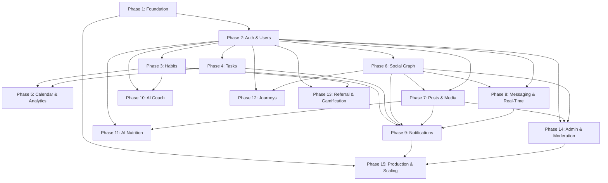

# HabitForge — Backend Development Roadmap

> **Single Source of Truth** for all backend engineering.
> Stack: **Node.js + Express + Mongoose (MongoDB) + Socket.IO + Redis + OpenAI API**
> Generated from a full audit of the web (`/web`) and mobile (`/mobile`) frontends, data models, AI integrations, and product blueprint (`/docs`).

---

## Table of Contents

1. [Executive Summary](#1-executive-summary)
2. [Architecture Overview](#2-architecture-overview)
3. [Phase 1 — Foundation & Infrastructure](#phase-1--foundation--infrastructure)
4. [Phase 2 — Authentication & User Management](#phase-2--authentication--user-management)
5. [Phase 3 — Habit Tracking Engine](#phase-3--habit-tracking-engine)
6. [Phase 4 — Task Management](#phase-4--task-management)
7. [Phase 5 — Calendar & Analytics](#phase-5--calendar--analytics)
8. [Phase 6 — Community & Social Graph](#phase-6--community--social-graph)
9. [Phase 7 — Posts, Reels & Media Pipeline](#phase-7--posts-reels--media-pipeline)
10. [Phase 8 — Direct Messaging & Real-Time](#phase-8--direct-messaging--real-time)
11. [Phase 9 — Notifications System](#phase-9--notifications-system)
12. [Phase 10 — AI Coach Service](#phase-10--ai-coach-service)
13. [Phase 11 — AI Nutrition Analysis](#phase-11--ai-nutrition-analysis)
14. [Phase 12 — Journeys & Long-Form Content](#phase-12--journeys--long-form-content)
15. [Phase 13 — Referral & Gamification System](#phase-13--referral--gamification-system)
16. [Phase 14 — Admin, Moderation & Reporting](#phase-14--admin-moderation--reporting)
17. [Phase 15 — Production Deployment, Monitoring & Scaling](#phase-15--production-deployment-monitoring--scaling)
18. [Dependency Graph](#dependency-graph)
19. [Data Model Summary (All Mongoose Schemas)](#data-model-summary)

---

## 1. Executive Summary

**HabitForge** is a habit tracking + social community + AI nutrition platform. The frontend currently uses local-only state (AsyncStorage on mobile, localStorage on web). This roadmap delivers a production-grade backend that replaces local persistence with a centralized API, enables multi-device sync, real-time social features, secure authentication, media storage, and AI-powered services.

### Core Business Domains Identified

| Domain | Description |
|--------|-------------|
| **Identity** | Auth, profiles, sessions, OAuth |
| **Habit Engine** | CRUD habits, daily logs, streaks, analytics |
| **Task Management** | To-do items with priority, due dates, completion |
| **Social Graph** | Follow/unfollow, requests, blocking, privacy |
| **Content** | Posts (text/gallery/video), reels, comments, likes, reposts |
| **Messaging** | 1:1 DMs with media, read receipts, real-time delivery |
| **Notifications** | Push (FCM/APNs), in-app, email digests |
| **AI Coach** | Conversational habit coaching powered by LLM |
| **AI Nutrition** | Meal photo → calorie/macro estimation via vision model |
| **Journeys** | Long-form diary entries (challenge, solution, lessons) |
| **Gamification** | Streaks, badges, referrals, streak shields |
| **Moderation** | Content reports, abuse handling, admin tools |

### User Journeys

1. **New User**: Landing → Sign Up → Onboarding Wizard → Dashboard
2. **Daily Check-In**: Open App → Dashboard → Tap habit → Log → Streak increments
3. **Community Browsing**: Community Tab → Feed → Like/Comment → View Profile → Follow
4. **Content Creation**: Community → "+" → Pick format → Upload media → Publish
5. **AI Nutrition**: Nutrition Tab → Capture meal → AI analysis → Review macros → Log
6. **Messaging**: Community → Profile → Message → Chat with media support
7. **AI Coach**: Coach Tab → Ask question → Receive personalized advice
8. **Journey Writing**: Journey → New → Write challenge/solution → Publish

---

## 2. Architecture Overview

```
┌────────────────────────────────────────────────────────────────┐
│                        CLIENTS                                 │
│   React Native (Expo)  ·  React Web  ·  Admin Dashboard       │
└─────────────────────────────┬──────────────────────────────────┘
                              │ HTTPS / WSS
┌─────────────────────────────▼──────────────────────────────────┐
│                     API GATEWAY (Express)                       │
│  Rate Limiting · CORS · Helmet · Auth Middleware · Validation  │
├────────────────────────────────────────────────────────────────┤
│  REST Routes                    │  WebSocket (Socket.IO)       │
│  /api/v1/auth/*                 │  DMs, notifications,         │
│  /api/v1/habits/*               │  typing indicators,          │
│  /api/v1/tasks/*                │  online presence             │
│  /api/v1/posts/*                │                              │
│  /api/v1/community/*            │                              │
│  /api/v1/coach/*                │                              │
│  /api/v1/nutrition/*            │                              │
│  /api/v1/journeys/*             │                              │
│  /api/v1/notifications/*        │                              │
│  /api/v1/admin/*                │                              │
├────────────────────────────────────────────────────────────────┤
│                      SERVICE LAYER                              │
│  AuthService · HabitService · PostService · DMService          │
│  NotificationService · AICoachService · NutritionAIService     │
│  MediaService · ModerationService · AnalyticsService           │
├────────────────────────────────────────────────────────────────┤
│               DATA & EXTERNAL SERVICES                         │
│  MongoDB (Mongoose)  ·  Redis (sessions, cache, pubsub)       │
│  AWS S3 / Cloudinary (media)  ·  OpenAI API (GPT-4o)          │
│  Firebase Cloud Messaging  ·  SendGrid (email)                │
│  Bull/BullMQ (job queues)                                      │
└────────────────────────────────────────────────────────────────┘
```

### Technology Decisions

| Concern | Choice | Rationale |
|---------|--------|-----------|
| Runtime | Node.js 20 LTS | Same language as frontend, async I/O |
| Framework | Express 4.x | Mature, extensive middleware ecosystem |
| ODM | Mongoose 8.x | Schema validation, middleware hooks, population |
| Database | MongoDB Atlas | Flexible documents suit habits/posts/social data |
| Cache/PubSub | Redis 7.x | Session store, rate limiting, Socket.IO adapter |
| Real-time | Socket.IO 4.x | Reliable WebSocket with fallbacks, rooms |
| Job Queue | BullMQ | Delayed jobs, retries, rate limiting for AI calls |
| Media Storage | AWS S3 + CloudFront (or Cloudinary) | Scalable object storage with CDN |
| AI | OpenAI GPT-4o | Vision + chat capabilities for both Coach and Nutrition |
| Push | Firebase Cloud Messaging | Cross-platform push notifications |
| Email | SendGrid | Transactional emails (verification, password reset) |
| Auth | JWT (access + refresh tokens) + bcrypt | Stateless auth with rotation |

---

## Phase 1 — Foundation & Infrastructure

### Purpose
Establish the project skeleton, development environment, CI/CD pipeline, database connection, and shared utilities that every subsequent phase depends on.

### Scope
- Express server setup with production-grade middleware
- MongoDB connection with Mongoose
- Redis connection
- Environment configuration management
- Logging and error handling
- API versioning structure
- Health check endpoints
- Docker development environment

### Features Included
- Express app with Helmet, CORS, compression, body parsing
- Global error handler with structured error responses
- Request logging (Morgan + Winston)
- MongoDB connection pooling and graceful shutdown
- Redis client initialization
- Environment variable validation (joi/zod schema)
- API response envelope pattern (`{ success, data, error, pagination }`)
- Rate limiting middleware (express-rate-limit + Redis store)

### Database Requirements
- MongoDB Atlas cluster (or local Docker)
- Connection string management via env vars
- Mongoose connection events handling (connected, disconnected, error)

### API Requirements
| Method | Endpoint | Description |
|--------|----------|-------------|
| GET | `/api/v1/health` | Server health + DB status |
| GET | `/api/v1/health/ready` | Readiness probe (DB + Redis connected) |

### Service Layer Requirements
- `DatabaseService` — Connection management, migration runner
- `CacheService` — Redis get/set/del with TTL helpers
- `LoggerService` — Winston logger with correlation IDs

### Dependencies
- None (this is the base layer)

### Acceptance Criteria
- [ ] Server starts and responds to health check
- [ ] MongoDB connects successfully
- [ ] Redis connects successfully
- [ ] Environment validation fails gracefully with clear messages
- [ ] Rate limiter blocks excessive requests (100 req/min per IP)
- [ ] All errors return consistent JSON envelope
- [ ] Docker Compose spins up server + MongoDB + Redis

### Development Checklist
- [ ] Initialize Node.js project with TypeScript
- [ ] Configure `tsconfig.json`, ESLint, Prettier
- [ ] Install and configure Express with middleware stack
- [ ] Set up Mongoose connection with retry logic
- [ ] Set up Redis connection (ioredis)
- [ ] Create `config/` module with environment validation
- [ ] Create global error handler middleware
- [ ] Create request logger middleware
- [ ] Create API response helpers (`sendSuccess`, `sendError`, `sendPaginated`)
- [ ] Create rate limiting middleware
- [ ] Create health check route
- [ ] Create `Dockerfile` and `docker-compose.yml`
- [ ] Set up GitHub Actions CI (lint + build)

---

## Phase 2 — Authentication & User Management

### Purpose
Secure user identity management. The frontend currently has placeholder auth (sign-in just navigates to dashboard). This phase implements real authentication with JWT tokens, password hashing, email verification, and profile management.

### Scope
- User registration with email/password
- Login with JWT access + refresh token pair
- Password hashing (bcrypt)
- Email verification flow
- Forgot/reset password flow
- Profile CRUD (name, username, avatar, bio, DOB, gender, country, timezone, height, weight, goals statement)
- Settings management (theme, notifications, reminder time, privacy, calorie target)
- Account deletion
- Token refresh and logout (blacklisting)
- OAuth prep (Google, Apple — structure only)

### Features Included
- Registration: name, email, password → hashed → stored → verification email sent
- Login: email + password → validate → issue access token (15min) + refresh token (7d)
- Token refresh: refresh token → validate → issue new pair → rotate old
- Logout: blacklist refresh token in Redis
- Email verification: send link with signed token → mark `emailVerified: true`
- Password reset: email → signed reset token (1h TTL) → new password
- Profile update: PATCH fields, avatar upload (presigned S3 URL)
- Username uniqueness with case-insensitive matching
- Settings persistence per user

### Database Requirements

**User Schema:**
```javascript
{
  email:           { type: String, unique: true, lowercase: true, required: true },
  passwordHash:    { type: String, required: true },
  name:            { type: String, required: true, trim: true },
  username:        { type: String, unique: true, lowercase: true, required: true },
  avatarUrl:       { type: String, default: "" },
  bio:             { type: String, default: "", maxlength: 300 },
  dob:             { type: Date },
  gender:          { type: String, enum: ["male", "female", "other", ""] },
  country:         { type: String, default: "" },
  timezone:        { type: String, default: "UTC" },
  heightCm:       { type: Number },
  weightKg:       { type: Number },
  goalsStatement:  { type: String, default: "" },
  referralCode:    { type: String, unique: true },
  referredBy:      { type: String },
  emailVerified:   { type: Boolean, default: false },
  privacy:         { type: String, enum: ["public", "followers", "private"], default: "public" },
  role:            { type: String, enum: ["user", "admin"], default: "user" },
  settings: {
    theme:          { type: String, enum: ["dark", "light"], default: "dark" },
    notifications:  { type: Boolean, default: true },
    reminderTime:   { type: String, default: "21:30" },
    calorieTarget:  { type: Number, default: 2200 },
    allowComments:  { type: Boolean, default: true },
    showActivity:   { type: Boolean, default: true }
  },
  pushTokens:      [{ token: String, platform: String, createdAt: Date }],
  lastActiveAt:    { type: Date },
  createdAt:       { type: Date, default: Date.now },
  updatedAt:       { type: Date, default: Date.now }
}
```
Indexes: `email` (unique), `username` (unique), `referralCode` (unique)

### API Requirements
| Method | Endpoint | Description |
|--------|----------|-------------|
| POST | `/api/v1/auth/register` | Create account |
| POST | `/api/v1/auth/login` | Email + password login |
| POST | `/api/v1/auth/refresh` | Refresh access token |
| POST | `/api/v1/auth/logout` | Blacklist refresh token |
| POST | `/api/v1/auth/verify-email` | Verify email with token |
| POST | `/api/v1/auth/forgot-password` | Send reset email |
| POST | `/api/v1/auth/reset-password` | Reset with token |
| GET | `/api/v1/users/me` | Get own profile |
| PATCH | `/api/v1/users/me` | Update profile fields |
| PATCH | `/api/v1/users/me/settings` | Update settings |
| DELETE | `/api/v1/users/me` | Delete account (soft) |
| GET | `/api/v1/users/:username` | Get public profile |
| POST | `/api/v1/users/me/avatar` | Upload avatar (presigned URL) |
| POST | `/api/v1/users/me/push-token` | Register push notification token |

### Service Layer Requirements
- `AuthService` — register, login, verifyEmail, forgotPassword, resetPassword, refreshToken
- `UserService` — getProfile, updateProfile, updateSettings, deleteAccount, getPublicProfile
- `TokenService` — sign/verify JWT, manage refresh token rotation, blacklist
- `EmailService` — send verification, send password reset (via SendGrid)

### Dependencies
- Phase 1 (Foundation)

### Acceptance Criteria
- [ ] User can register with email/password and receives verification email
- [ ] User can login and receives JWT access + refresh tokens
- [ ] Invalid/expired tokens return 401
- [ ] Refresh token rotation works (old token invalidated)
- [ ] Password reset flow works end-to-end
- [ ] Profile CRUD works with avatar upload
- [ ] Username uniqueness enforced (case-insensitive)
- [ ] Rate limiting on auth endpoints (5 attempts/min)
- [ ] Passwords never stored or returned in plaintext

### Development Checklist
- [ ] Create User Mongoose model with validation
- [ ] Implement bcrypt password hashing (12 rounds)
- [ ] Implement JWT signing/verification utilities
- [ ] Create auth middleware (extract & verify token)
- [ ] Implement registration endpoint with validation
- [ ] Implement login endpoint
- [ ] Implement refresh token rotation with Redis blacklist
- [ ] Implement email verification flow
- [ ] Implement forgot/reset password flow
- [ ] Create profile GET/PATCH endpoints
- [ ] Create settings PATCH endpoint
- [ ] Create avatar upload (presigned URL generation)
- [ ] Create push token registration endpoint
- [ ] Write input validation schemas (Joi/Zod)
- [ ] Write unit tests for AuthService
- [ ] Write integration tests for auth endpoints

---

## Phase 3 — Habit Tracking Engine

### Purpose
Core business logic of the app. Users create habits with goals, log daily completions, and the system computes streaks, completion rates, and analytics. Currently all computed client-side — the backend must own this logic for consistency, leaderboards, and multi-device sync.

### Scope
- Habit CRUD (name, icon, goal, unit, category, color, schedule)
- Daily habit logging (increment/decrement/complete)
- Streak calculation (server-authoritative)
- Habit archiving and restoration
- Category management
- Completion analytics (daily/weekly/monthly)
- Habit presets/templates

### Features Included
- Create habit with name, icon, goal, unit, category, color
- Edit any habit property
- Delete (soft) / archive / restore
- Log completion for a specific date (supports past logging within 7 days)
- Automatic streak calculation on each log
- Grace period / streak shield (gamification: max 1 per 30 days)
- Monthly completion matrix (habit × days grid data)
- Weekly/monthly analytics computation

### Database Requirements

**Habit Schema:**
```javascript
{
  userId:     { type: ObjectId, ref: "User", required: true, index: true },
  name:       { type: String, required: true, trim: true },
  icon:       { type: String, default: "spark" },
  goal:       { type: Number, required: true, min: 1 },
  unit:       { type: String, default: "times" },
  category:   { type: String, default: "General" },
  color:      { type: String, default: "#22d3ee" },
  schedule:   { type: [String], default: ["mon","tue","wed","thu","fri","sat","sun"] },
  archived:   { type: Boolean, default: false },
  archivedAt: { type: Date },
  createdAt:  { type: Date, default: Date.now },
  updatedAt:  { type: Date, default: Date.now }
}
```

**HabitLog Schema:**
```javascript
{
  habitId:    { type: ObjectId, ref: "Habit", required: true },
  userId:     { type: ObjectId, ref: "User", required: true },
  date:       { type: String, required: true },  // "YYYY-MM-DD"
  value:      { type: Number, required: true },  // current logged value
  completed:  { type: Boolean, default: false }, // value >= goal
  note:       { type: String, default: "" },
  mood:       { type: String, enum: ["great","good","okay","bad","terrible",""], default: "" },
  createdAt:  { type: Date, default: Date.now }
}
```
Compound index: `{ habitId, date }` (unique), `{ userId, date }`

**Streak Schema (denormalized for performance):**
```javascript
{
  habitId:       { type: ObjectId, ref: "Habit", required: true, unique: true },
  userId:        { type: ObjectId, ref: "User", required: true },
  currentStreak: { type: Number, default: 0 },
  longestStreak: { type: Number, default: 0 },
  lastLogDate:   { type: String },
  shieldUsedAt:  { type: Date },
  updatedAt:     { type: Date, default: Date.now }
}
```

### API Requirements
| Method | Endpoint | Description |
|--------|----------|-------------|
| GET | `/api/v1/habits` | List user's habits (active) |
| GET | `/api/v1/habits/archived` | List archived habits |
| POST | `/api/v1/habits` | Create habit |
| GET | `/api/v1/habits/:id` | Get habit with current streak |
| PATCH | `/api/v1/habits/:id` | Update habit |
| DELETE | `/api/v1/habits/:id` | Archive habit |
| POST | `/api/v1/habits/:id/restore` | Restore archived habit |
| POST | `/api/v1/habits/:id/log` | Log completion for date |
| DELETE | `/api/v1/habits/:id/log/:date` | Remove log for date |
| GET | `/api/v1/habits/:id/logs` | Get logs (date range) |
| GET | `/api/v1/habits/:id/analytics` | Weekly/monthly analytics |
| GET | `/api/v1/habits/matrix` | Month matrix (all habits × days) |
| GET | `/api/v1/habits/summary` | Dashboard summary stats |
| POST | `/api/v1/habits/:id/shield` | Use streak shield |
| GET | `/api/v1/habits/presets` | List habit templates |

### Service Layer Requirements
- `HabitService` — CRUD, log, computeStreak, analytics, matrix, dashboard summary
- `StreakService` — calculate streak on log, handle grace period, longest streak tracking

### Dependencies
- Phase 1 (Foundation)
- Phase 2 (Auth — user identity)

### Acceptance Criteria
- [ ] User can CRUD habits
- [ ] Logging a completion recalculates streak in real-time
- [ ] Streak breaks correctly when a scheduled day is missed
- [ ] Streak shield prevents one break per 30 days
- [ ] Monthly matrix endpoint returns correct grid data
- [ ] Dashboard summary returns habits count, today's progress, month average
- [ ] Archived habits excluded from active queries
- [ ] Past-date logging allowed within 7-day window only

### Development Checklist
- [ ] Create Habit, HabitLog, Streak Mongoose models
- [ ] Implement habit CRUD endpoints with ownership validation
- [ ] Implement log endpoint with streak recalculation
- [ ] Implement streak computation algorithm (handle timezone)
- [ ] Implement streak shield logic
- [ ] Implement month matrix aggregation
- [ ] Implement dashboard summary aggregation
- [ ] Implement analytics endpoint (weekly trends, monthly heatmap)
- [ ] Create habit preset seed data
- [ ] Write unit tests for streak logic
- [ ] Write integration tests

---

## Phase 4 — Task Management

### Purpose
Lightweight task/to-do system that complements habits. Users create tasks with priority and due dates. Tasks appear on the dashboard and calendar views.

### Scope
- Task CRUD with title, notes, due date, priority
- Task completion toggle
- Filtering by status (open, done, overdue, today)
- Grouping by due date

### Features Included
- Create task with title, notes, due date, priority (low/medium/high)
- Edit task
- Mark done/undone
- Delete task
- List with filters: all, open, today, overdue, done
- Overdue detection (due < today && !done)

### Database Requirements

**Task Schema:**
```javascript
{
  userId:    { type: ObjectId, ref: "User", required: true, index: true },
  title:     { type: String, required: true, trim: true },
  notes:     { type: String, default: "" },
  due:       { type: String },  // "YYYY-MM-DD"
  priority:  { type: String, enum: ["low", "medium", "high"], default: "medium" },
  done:      { type: Boolean, default: false },
  doneAt:    { type: Date },
  createdAt: { type: Date, default: Date.now },
  updatedAt: { type: Date, default: Date.now }
}
```
Indexes: `{ userId, due }`, `{ userId, done }`

### API Requirements
| Method | Endpoint | Description |
|--------|----------|-------------|
| GET | `/api/v1/tasks` | List tasks (query: status, due) |
| POST | `/api/v1/tasks` | Create task |
| PATCH | `/api/v1/tasks/:id` | Update task |
| PATCH | `/api/v1/tasks/:id/toggle` | Toggle done status |
| DELETE | `/api/v1/tasks/:id` | Delete task |
| GET | `/api/v1/tasks/summary` | Counts by status |

### Service Layer Requirements
- `TaskService` — CRUD, toggle, filter, summary counts

### Dependencies
- Phase 1 (Foundation)
- Phase 2 (Auth)

### Acceptance Criteria
- [ ] User can CRUD tasks
- [ ] Toggle marks done with timestamp
- [ ] Filtering returns correct subsets
- [ ] Overdue tasks correctly identified
- [ ] Summary returns accurate counts

### Development Checklist
- [ ] Create Task Mongoose model
- [ ] Implement CRUD endpoints
- [ ] Implement toggle endpoint
- [ ] Implement filtering logic
- [ ] Implement summary aggregation
- [ ] Write tests

---

## Phase 5 — Calendar & Analytics

### Purpose
Unified calendar view combining habit completions and tasks. Server-computed analytics for dashboard, weekly reviews, and monthly reports.

### Scope
- Calendar data aggregation (habits + tasks per day)
- Daily/weekly/monthly completion percentages
- Weekly review data generation
- Leaderboard computation (top habits by consistency)
- Dashboard statistics

### Features Included
- Calendar month view data: for each day → habit completion %, task count
- Week view data: per-hour routine slots (future)
- Dashboard stats: today's progress, month average, longest streak, top 5 habits
- Weekly review: wins, misses, consistency score
- Monthly review: strongest habit, weakest habit, trends

### Database Requirements
No new schemas — uses aggregation queries on Habit, HabitLog, Task

### API Requirements
| Method | Endpoint | Description |
|--------|----------|-------------|
| GET | `/api/v1/calendar/:year/:month` | Month calendar data |
| GET | `/api/v1/analytics/dashboard` | Dashboard stats |
| GET | `/api/v1/analytics/weekly` | Current week review |
| GET | `/api/v1/analytics/monthly/:year/:month` | Monthly report |
| GET | `/api/v1/analytics/streaks` | All habit streaks summary |

### Service Layer Requirements
- `AnalyticsService` — aggregation pipelines for calendar, dashboard, reviews

### Dependencies
- Phase 3 (Habits)
- Phase 4 (Tasks)

### Acceptance Criteria
- [ ] Calendar endpoint returns per-day completion percentages
- [ ] Dashboard stats match client-computed values
- [ ] Weekly/monthly reviews provide actionable data
- [ ] Performance < 200ms for typical user (< 20 habits, 90 days history)

### Development Checklist
- [ ] Implement calendar aggregation pipeline
- [ ] Implement dashboard stats endpoint
- [ ] Implement weekly review computation
- [ ] Implement monthly report computation
- [ ] Add Redis caching for frequently-accessed analytics (TTL: 5min)
- [ ] Write tests

---

## Phase 6 — Community & Social Graph

### Purpose
The social backbone of HabitForge. Users follow each other, with public/private account support, follow requests, blocking, and user discovery.

### Scope
- Follow/unfollow users
- Follow requests for private accounts (approve/decline)
- Block/unblock users
- Followers/following lists
- User search and discovery
- Privacy enforcement (blocked users can't see content)

### Features Included
- Follow public user → instant follow
- Follow private user → sends request → user approves/declines
- Cancel pending follow request
- Unfollow
- Block user (removes all connections, hides content bidirectionally)
- Unblock user
- Get followers list (paginated)
- Get following list (paginated)
- Get pending incoming requests
- Get pending outgoing requests
- Search users by name/username (with privacy filtering)
- User suggestion (users you might want to follow)

### Database Requirements

**Follow Schema:**
```javascript
{
  followerId:  { type: ObjectId, ref: "User", required: true },
  followingId: { type: ObjectId, ref: "User", required: true },
  status:      { type: String, enum: ["accepted", "pending"], default: "accepted" },
  createdAt:   { type: Date, default: Date.now }
}
```
Compound index: `{ followerId, followingId }` (unique), `{ followingId, status }`

**Block Schema:**
```javascript
{
  blockerId:  { type: ObjectId, ref: "User", required: true },
  blockedId:  { type: ObjectId, ref: "User", required: true },
  createdAt:  { type: Date, default: Date.now }
}
```
Compound index: `{ blockerId, blockedId }` (unique)

### API Requirements
| Method | Endpoint | Description |
|--------|----------|-------------|
| POST | `/api/v1/community/follow/:username` | Follow or request |
| DELETE | `/api/v1/community/follow/:username` | Unfollow or cancel request |
| POST | `/api/v1/community/follow/:username/accept` | Accept follow request |
| POST | `/api/v1/community/follow/:username/decline` | Decline follow request |
| GET | `/api/v1/community/followers` | My followers (paginated) |
| GET | `/api/v1/community/following` | Who I follow (paginated) |
| GET | `/api/v1/community/requests/incoming` | Pending incoming |
| GET | `/api/v1/community/requests/outgoing` | Pending outgoing |
| POST | `/api/v1/community/block/:username` | Block user |
| DELETE | `/api/v1/community/block/:username` | Unblock user |
| GET | `/api/v1/community/blocked` | My blocked list |
| GET | `/api/v1/community/search` | Search users (query param) |
| GET | `/api/v1/community/suggestions` | Suggested users to follow |
| GET | `/api/v1/community/:username/followers` | User's followers |
| GET | `/api/v1/community/:username/following` | User's following |

### Service Layer Requirements
- `FollowService` — follow, unfollow, approve, decline, cancel, lists
- `BlockService` — block, unblock, check blocked status
- `DiscoveryService` — search, suggestions algorithm

### Dependencies
- Phase 2 (Auth & Users)

### Acceptance Criteria
- [ ] Follow public account → instant mutual visibility
- [ ] Follow private account → pending request
- [ ] Accept/decline requests work correctly
- [ ] Blocked user cannot see blocker's content or profile
- [ ] Block removes existing follow relationships
- [ ] Search respects privacy (blocked users excluded)
- [ ] Pagination works correctly on all list endpoints
- [ ] Follower/following counts stay consistent

### Development Checklist
- [ ] Create Follow and Block Mongoose models
- [ ] Implement follow/unfollow with privacy check
- [ ] Implement request accept/decline
- [ ] Implement block/unblock with cascading relationship removal
- [ ] Implement followers/following list endpoints
- [ ] Implement user search with text index
- [ ] Implement suggestions algorithm (mutual follows, same habits)
- [ ] Add privacy middleware (check block status before serving content)
- [ ] Write tests

---

## Phase 7 — Posts, Reels & Media Pipeline

### Purpose
Content creation and consumption engine. Users publish posts (text, gallery, video/reel), and interact through likes, comments, reposts, and saves. Media files are stored in cloud object storage with CDN delivery.

### Scope
- Post creation (text, gallery, video/reel)
- Media upload pipeline (presigned URLs, processing)
- Feed generation (personalized, chronological)
- Likes, comments, reposts, saves
- Post/comment editing and deletion
- Content visibility (respects blocks and privacy)
- Hashtag and tag support

### Features Included
- Create post: text-only, gallery (up to 10 images), or video (reel)
- Upload media via presigned S3 URLs (client uploads directly)
- Video transcoding (background job — generate thumbnail, compress)
- Image resizing (generate multiple sizes for feed/detail)
- Like/unlike post (with count)
- Comment on post (add/edit/delete)
- Repost/unrepost
- Save/unsave (bookmarks)
- Feed: posts from followed users + own posts, ordered by recency
- Explore feed: trending/popular posts from all public users
- Single post detail
- User's posts list
- Hashtag feed

### Database Requirements

**Post Schema:**
```javascript
{
  userId:     { type: ObjectId, ref: "User", required: true, index: true },
  kind:       { type: String, enum: ["post", "reel"], default: "post" },
  format:     { type: String, enum: ["text", "gallery", "video"], default: "text" },
  caption:    { type: String, default: "", maxlength: 2200 },
  media:      [{ url: String, type: String, width: Number, height: Number, thumbnail: String }],
  tags:       [{ type: String, lowercase: true }],
  song:       { type: String, default: "" },
  likesCount:   { type: Number, default: 0 },
  commentsCount: { type: Number, default: 0 },
  repostsCount:  { type: Number, default: 0 },
  visibility:    { type: String, enum: ["public", "followers", "private"], default: "public" },
  createdAt:  { type: Date, default: Date.now },
  updatedAt:  { type: Date, default: Date.now }
}
```
Indexes: `{ userId, createdAt: -1 }`, `{ tags }`, `{ createdAt: -1 }` (for explore)

**Like Schema:**
```javascript
{
  userId: { type: ObjectId, ref: "User", required: true },
  postId: { type: ObjectId, ref: "Post", required: true },
  createdAt: { type: Date, default: Date.now }
}
```
Compound index: `{ userId, postId }` (unique)

**Comment Schema:**
```javascript
{
  postId:    { type: ObjectId, ref: "Post", required: true, index: true },
  userId:    { type: ObjectId, ref: "User", required: true },
  text:      { type: String, required: true, maxlength: 1000 },
  createdAt: { type: Date, default: Date.now },
  updatedAt: { type: Date, default: Date.now }
}
```
Index: `{ postId, createdAt }`

**Repost Schema:**
```javascript
{
  userId: { type: ObjectId, ref: "User", required: true },
  postId: { type: ObjectId, ref: "Post", required: true },
  createdAt: { type: Date, default: Date.now }
}
```
Compound index: `{ userId, postId }` (unique)

**Save Schema:**
```javascript
{
  userId: { type: ObjectId, ref: "User", required: true },
  postId: { type: ObjectId, ref: "Post", required: true },
  createdAt: { type: Date, default: Date.now }
}
```
Compound index: `{ userId, postId }` (unique)

### API Requirements
| Method | Endpoint | Description |
|--------|----------|-------------|
| POST | `/api/v1/posts` | Create post |
| GET | `/api/v1/posts/:id` | Get single post |
| PATCH | `/api/v1/posts/:id` | Edit caption/tags |
| DELETE | `/api/v1/posts/:id` | Delete post |
| GET | `/api/v1/posts/feed` | Personalized feed (paginated) |
| GET | `/api/v1/posts/explore` | Explore/trending feed |
| GET | `/api/v1/posts/user/:username` | User's posts |
| GET | `/api/v1/posts/tag/:tag` | Posts by hashtag |
| GET | `/api/v1/posts/saved` | My saved posts |
| POST | `/api/v1/posts/:id/like` | Like post |
| DELETE | `/api/v1/posts/:id/like` | Unlike post |
| GET | `/api/v1/posts/:id/comments` | Get comments (paginated) |
| POST | `/api/v1/posts/:id/comments` | Add comment |
| PATCH | `/api/v1/posts/:id/comments/:commentId` | Edit comment |
| DELETE | `/api/v1/posts/:id/comments/:commentId` | Delete comment |
| POST | `/api/v1/posts/:id/repost` | Repost |
| DELETE | `/api/v1/posts/:id/repost` | Unrepost |
| POST | `/api/v1/posts/:id/save` | Save/bookmark |
| DELETE | `/api/v1/posts/:id/save` | Unsave |
| POST | `/api/v1/media/presign` | Get presigned upload URL |
| POST | `/api/v1/media/confirm` | Confirm upload complete |

### Service Layer Requirements
- `PostService` — CRUD, feed generation, explore, user posts
- `InteractionService` — like, comment, repost, save with atomic counter updates
- `MediaService` — presigned URL generation, upload confirmation, processing trigger
- `FeedService` — personalized feed algorithm (fan-out on read)

### Background Jobs
- `processMedia` — On upload confirmation: resize images, generate thumbnails, transcode video
- `updateFeedCache` — Optional: precompute feeds for active users

### Dependencies
- Phase 2 (Auth)
- Phase 6 (Social Graph — feed relies on follow relationships)

### Acceptance Criteria
- [ ] User can create post with text/images/video
- [ ] Media upload via presigned URL works (direct to S3)
- [ ] Feed returns posts from followed users, ordered by recency
- [ ] Explore returns popular posts from public users
- [ ] Like/unlike atomically updates count
- [ ] Comments CRUD works with ownership enforcement
- [ ] Repost/save work correctly
- [ ] Blocked users' posts excluded from all feeds
- [ ] Private users' posts only visible to approved followers
- [ ] Media processing generates thumbnails

### Development Checklist
- [ ] Create Post, Like, Comment, Repost, Save Mongoose models
- [ ] Implement media presigned URL endpoint (S3)
- [ ] Implement post creation endpoint (validate media references)
- [ ] Implement personalized feed (aggregate from followed users)
- [ ] Implement explore feed (popular posts algorithm)
- [ ] Implement like/unlike with atomic $inc
- [ ] Implement comment CRUD
- [ ] Implement repost/save
- [ ] Set up media processing job (BullMQ)
- [ ] Implement image resizing worker (Sharp)
- [ ] Implement video thumbnail extraction (ffmpeg)
- [ ] Add privacy filtering middleware
- [ ] Write tests

---

## Phase 8 — Direct Messaging & Real-Time

### Purpose
1:1 messaging between users with media support, typing indicators, and real-time delivery via WebSocket.

### Scope
- Send text messages
- Send media messages (image/video)
- Real-time delivery via Socket.IO
- Conversation list with last message preview
- Read receipts
- Typing indicators
- Online presence
- Message history pagination

### Features Included
- Send text DM to any user (no follow required, as per current frontend behavior)
- Send image/video with DM
- Real-time delivery: sender sends → server persists → Socket.IO emits to recipient
- Conversation list: all users you've messaged, sorted by last message time
- Unread count per conversation
- Read receipts (mark conversation as read)
- Typing indicator (transient, Socket.IO only, not persisted)
- Online/offline presence via Socket.IO connection status
- Block enforcement: blocked users cannot send messages

### Database Requirements

**Conversation Schema:**
```javascript
{
  participants: [{ type: ObjectId, ref: "User" }],  // exactly 2
  lastMessage:  {
    text: String,
    mediaType: String,
    senderId: ObjectId,
    createdAt: Date
  },
  readBy: [{ userId: ObjectId, readAt: Date }],
  createdAt: { type: Date, default: Date.now },
  updatedAt: { type: Date, default: Date.now }
}
```
Indexes: `{ participants }`, `{ updatedAt: -1 }`

**Message Schema:**
```javascript
{
  conversationId: { type: ObjectId, ref: "Conversation", required: true, index: true },
  senderId:       { type: ObjectId, ref: "User", required: true },
  text:           { type: String, default: "" },
  mediaUrl:       { type: String },
  mediaType:      { type: String, enum: ["image", "video", ""] },
  createdAt:      { type: Date, default: Date.now }
}
```
Index: `{ conversationId, createdAt }`

### API Requirements
| Method | Endpoint | Description |
|--------|----------|-------------|
| GET | `/api/v1/messages/conversations` | List conversations |
| GET | `/api/v1/messages/:conversationId` | Get messages (paginated) |
| POST | `/api/v1/messages/:username` | Send message |
| POST | `/api/v1/messages/:conversationId/read` | Mark as read |
| GET | `/api/v1/messages/unread-count` | Total unread count |

### WebSocket Events
| Event | Direction | Description |
|-------|-----------|-------------|
| `dm:new` | Server→Client | New message received |
| `dm:send` | Client→Server | Send message |
| `dm:typing` | Bidirectional | Typing indicator |
| `dm:read` | Client→Server | Mark read |
| `presence:online` | Server→Client | User came online |
| `presence:offline` | Server→Client | User went offline |

### Service Layer Requirements
- `MessageService` — send, getConversations, getMessages, markRead
- `SocketService` — Socket.IO setup, room management, event handlers
- `PresenceService` — track online users in Redis set

### Dependencies
- Phase 2 (Auth)
- Phase 6 (Social Graph — block enforcement)
- Phase 1 (Redis — presence, pub/sub for multi-instance)

### Acceptance Criteria
- [ ] User can send text/media DM to any non-blocked user
- [ ] Messages delivered in real-time via WebSocket
- [ ] Conversation list shows last message and unread count
- [ ] Read receipts update on viewing conversation
- [ ] Typing indicator appears/disappears in real-time
- [ ] Blocked users cannot send messages (error returned)
- [ ] Messages paginate correctly (cursor-based)
- [ ] Works across multiple server instances (Redis adapter)

### Development Checklist
- [ ] Create Conversation and Message Mongoose models
- [ ] Set up Socket.IO with Redis adapter (for horizontal scaling)
- [ ] Implement JWT auth for WebSocket connections
- [ ] Implement send message endpoint + socket emission
- [ ] Implement conversation list with last message
- [ ] Implement message history with cursor pagination
- [ ] Implement read receipts
- [ ] Implement typing indicator (socket-only, debounced)
- [ ] Implement presence tracking in Redis
- [ ] Implement block enforcement in message sending
- [ ] Write tests

---

## Phase 9 — Notifications System

### Purpose
Unified notification system for social interactions (likes, comments, follows), reminders (habit check-in, task due), and system messages. Supports in-app, push (FCM/APNs), and email channels.

### Scope
- In-app notification storage and retrieval
- Push notification delivery (FCM)
- Email notification delivery (digest)
- Notification preferences per type
- Mark read / mark all read
- Real-time in-app delivery via Socket.IO
- Scheduled reminder jobs (habit/task)

### Features Included
- Notification types: like, comment, repost, follow, follow_request, message, reminder, system
- In-app feed: sorted by timestamp, unread indicator
- Push delivery: when user is offline, send push notification
- Email digest: daily summary of unread notifications (optional)
- Mark individual or all as read
- Unread count badge (real-time via socket)
- Scheduled reminders: at `settings.reminderTime`, check incomplete habits → send push
- Task due reminders: morning of due date

### Database Requirements

**Notification Schema:**
```javascript
{
  userId:    { type: ObjectId, ref: "User", required: true, index: true },
  type:      { type: String, enum: ["like","comment","repost","follow","follow_request","message","reminder","system"], required: true },
  fromUserId: { type: ObjectId, ref: "User" },
  postId:    { type: ObjectId, ref: "Post" },
  text:      { type: String, required: true },
  read:      { type: Boolean, default: false },
  data:      { type: Object },  // flexible payload
  createdAt: { type: Date, default: Date.now }
}
```
Indexes: `{ userId, createdAt: -1 }`, `{ userId, read }`

### API Requirements
| Method | Endpoint | Description |
|--------|----------|-------------|
| GET | `/api/v1/notifications` | List notifications (paginated) |
| GET | `/api/v1/notifications/unread-count` | Unread count |
| PATCH | `/api/v1/notifications/:id/read` | Mark one as read |
| PATCH | `/api/v1/notifications/read-all` | Mark all as read |
| PATCH | `/api/v1/notifications/settings` | Update notification preferences |

### WebSocket Events
| Event | Direction | Description |
|-------|-----------|-------------|
| `notification:new` | Server→Client | New notification |
| `notification:count` | Server→Client | Updated unread count |

### Background Jobs
- `sendPush` — Triggered on new notification: check if user offline → send FCM push
- `habitReminder` — Cron: at each user's reminder time, check incomplete habits → notify
- `taskDueReminder` — Cron: morning, check tasks due today → notify
- `emailDigest` — Cron: daily, compile unread notifications → send email summary

### Service Layer Requirements
- `NotificationService` — create, list, markRead, unreadCount
- `PushService` — send FCM push notification
- `ReminderService` — habit/task reminder scheduling

### Dependencies
- Phase 2 (Auth — user preferences, push tokens)
- Phase 3 (Habits — reminder logic)
- Phase 4 (Tasks — due date reminders)
- Phase 6 (Social — follow notifications)
- Phase 7 (Posts — like/comment/repost notifications)
- Phase 8 (Messaging — message notifications)

### Acceptance Criteria
- [ ] Notifications created on social interactions (like, comment, follow, etc.)
- [ ] In-app notifications delivered in real-time via socket
- [ ] Push notifications sent when user is offline
- [ ] Unread count updates in real-time
- [ ] Mark read/all-read works
- [ ] Habit reminders fire at configured time
- [ ] Task due reminders fire morning of due date
- [ ] Notification preferences respected

### Development Checklist
- [ ] Create Notification Mongoose model
- [ ] Implement notification creation helper (used by other services)
- [ ] Implement list/read/count endpoints
- [ ] Integrate Socket.IO for real-time delivery
- [ ] Set up Firebase Admin SDK for push
- [ ] Implement push delivery worker
- [ ] Implement habit reminder cron job
- [ ] Implement task due reminder cron job
- [ ] Implement email digest job (SendGrid)
- [ ] Hook notification creation into social interaction services
- [ ] Write tests

---

## Phase 10 — AI Coach Service

### Purpose
Conversational AI coaching for habits, sleep, nutrition, and wellness. The frontend currently uses a simple keyword-matching function (`buildCoachReply`). The backend will use OpenAI GPT-4o with user context (habits, streaks, stats) injected as system context.

### Scope
- Chat session management (create, list, delete)
- Message sending with AI response generation
- Context injection (user's habits, streaks, goals)
- Conversation history management
- Rate limiting per user (AI API cost control)

### Features Included
- Create new coach chat session
- Send message → GPT-4o generates personalized response
- System prompt includes: user's habits, current streaks, goals statement, recent performance
- Conversation history passed for continuity
- List chat sessions with titles
- Delete chat session
- Rate limit: 50 messages/day per free user

### Database Requirements

**CoachChat Schema:**
```javascript
{
  userId:    { type: ObjectId, ref: "User", required: true, index: true },
  title:     { type: String, default: "New chat" },
  messages:  [{
    role:      { type: String, enum: ["user", "coach"], required: true },
    text:      { type: String, required: true },
    createdAt: { type: Date, default: Date.now }
  }],
  createdAt: { type: Date, default: Date.now },
  updatedAt: { type: Date, default: Date.now }
}
```
Index: `{ userId, updatedAt: -1 }`

### API Requirements
| Method | Endpoint | Description |
|--------|----------|-------------|
| GET | `/api/v1/coach/chats` | List coach chats |
| POST | `/api/v1/coach/chats` | Create new chat |
| GET | `/api/v1/coach/chats/:id` | Get chat with messages |
| DELETE | `/api/v1/coach/chats/:id` | Delete chat |
| POST | `/api/v1/coach/chats/:id/messages` | Send message (returns AI reply) |

### Service Layer Requirements
- `CoachService` — chat CRUD, message handling
- `AIService` — OpenAI API wrapper with retry, timeout, error handling
- `ContextBuilder` — assemble user context (habits, streaks, stats) for system prompt

### Background Jobs
- `coachReply` — Async job: receives message, calls OpenAI, stores response, emits via socket

### Dependencies
- Phase 2 (Auth)
- Phase 3 (Habits — context data)

### Acceptance Criteria
- [ ] User can create/list/delete chat sessions
- [ ] Sending a message returns a contextual AI response
- [ ] AI response considers user's actual habit data and streaks
- [ ] Rate limiting enforced (50 msg/day)
- [ ] Graceful handling of OpenAI API failures
- [ ] Chat title auto-generated from first message

### Development Checklist
- [ ] Create CoachChat Mongoose model
- [ ] Implement chat CRUD endpoints
- [ ] Implement message endpoint with OpenAI integration
- [ ] Build context assembler (habits, streaks, goals)
- [ ] Implement rate limiting (Redis counter per user per day)
- [ ] Handle streaming responses (optional: SSE for real-time typing)
- [ ] Implement error handling for API failures
- [ ] Write tests

---

## Phase 11 — AI Nutrition Analysis

### Purpose
Meal photo analysis using GPT-4o vision model. Users upload a meal photo, the system estimates calories, macros, and provides suggestions. Results are logged daily toward calorie targets.

### Scope
- Meal photo upload and analysis
- Nutrition result storage and history
- Daily nutrition log with totals
- Chat-style interaction (ask follow-up questions)
- Ingredient correction flow (user edits detected items)

### Features Included
- Upload meal photo → GPT-4o vision analysis → structured nutrition data
- Store analysis results per meal per day
- Daily totals (calories, protein, carbs, fat, fiber)
- Weekly nutrition report
- Chat sessions for nutrition Q&A
- Ingredient correction: user edits items → re-calculate totals
- Calorie target tracking (intake vs target)

### Database Requirements

**NutritionAnalysis Schema:**
```javascript
{
  userId:     { type: ObjectId, ref: "User", required: true, index: true },
  chatId:     { type: ObjectId, ref: "NutritionChat" },
  imageUrl:   { type: String, required: true },
  mealType:   { type: String, enum: ["breakfast","lunch","dinner","snack"], default: "meal" },
  date:       { type: String, required: true },  // "YYYY-MM-DD"
  result: {
    meal:       String,
    confidence: Number,
    calories:   Number,
    protein:    Number,
    carbs:      Number,
    fat:        Number,
    fiber:      Number,
    items:      [{ name: String, calories: Number, portion: String }],
    suggestions: [String]
  },
  corrected:     { type: Boolean, default: false },
  correctedResult: { type: Object },
  createdAt:  { type: Date, default: Date.now }
}
```
Indexes: `{ userId, date }`, `{ userId, createdAt: -1 }`

**NutritionChat Schema:**
```javascript
{
  userId:    { type: ObjectId, ref: "User", required: true, index: true },
  title:     { type: String, default: "New chat" },
  messages:  [{
    role:      { type: String, enum: ["user", "coach"], required: true },
    text:      { type: String, required: true },
    imageUrl:  { type: String },
    nutrition: { type: Object },
    createdAt: { type: Date, default: Date.now }
  }],
  createdAt: { type: Date, default: Date.now },
  updatedAt: { type: Date, default: Date.now }
}
```

### API Requirements
| Method | Endpoint | Description |
|--------|----------|-------------|
| POST | `/api/v1/nutrition/analyze` | Upload image + analyze |
| GET | `/api/v1/nutrition/log/:date` | Get day's nutrition log |
| GET | `/api/v1/nutrition/log` | Get date range nutrition |
| GET | `/api/v1/nutrition/weekly` | Weekly nutrition report |
| PATCH | `/api/v1/nutrition/:id/correct` | Correct analysis items |
| GET | `/api/v1/nutrition/chats` | List nutrition chats |
| POST | `/api/v1/nutrition/chats` | Create new chat |
| GET | `/api/v1/nutrition/chats/:id` | Get chat |
| DELETE | `/api/v1/nutrition/chats/:id` | Delete chat |
| POST | `/api/v1/nutrition/chats/:id/messages` | Send message |

### Service Layer Requirements
- `NutritionService` — analyze, log CRUD, daily totals, weekly report
- `NutritionAIService` — OpenAI vision API call, response parsing, validation
- `NutritionChatService` — chat CRUD, message handling

### Background Jobs
- `analyzeImage` — Async: receives image URL, calls GPT-4o vision, stores result, notifies user

### Dependencies
- Phase 2 (Auth)
- Phase 7 (Media pipeline — image upload to S3)

### Acceptance Criteria
- [ ] User uploads meal photo and receives structured nutrition data
- [ ] Results stored and accessible in daily log
- [ ] Daily totals calculated correctly
- [ ] Weekly report aggregates properly
- [ ] Ingredient correction recalculates totals
- [ ] Rate limiting on AI calls (10 analyses/day)
- [ ] Graceful error handling for AI failures

### Development Checklist
- [ ] Create NutritionAnalysis and NutritionChat models
- [ ] Implement image upload + analysis endpoint
- [ ] Implement GPT-4o vision API integration (reuse from nutritionAI.ts pattern)
- [ ] Implement response parsing and validation
- [ ] Implement daily log endpoint
- [ ] Implement weekly report aggregation
- [ ] Implement correction endpoint
- [ ] Implement nutrition chat CRUD + messaging
- [ ] Add rate limiting (Redis)
- [ ] Write tests

---

## Phase 12 — Journeys & Long-Form Content

### Purpose
Long-form diary/story entries where users document their habit-building journey: challenges faced, solutions found, and lessons learned. These are shared with the community as inspirational content.

### Scope
- Journey entry creation (challenge, helped, remained/overcame)
- Journey listing and detail view
- Public/private visibility
- Like and comment on journeys
- Journey search and discovery

### Features Included
- Create journey entry with structured fields (challenge, whatHelped, problemRemained)
- Edit/delete own journeys
- List own journeys (with pagination)
- List public journeys feed (community discovery)
- Journey detail view
- Like/comment on journeys (reuse interaction models)
- Tag journeys with related habits

### Database Requirements

**Journey Schema:**
```javascript
{
  userId:       { type: ObjectId, ref: "User", required: true, index: true },
  challenge:    { type: String, required: true },
  helped:       { type: String, required: true },
  overcame:     { type: String, required: true },
  habitTags:    [{ type: String }],
  visibility:   { type: String, enum: ["public", "private"], default: "public" },
  likesCount:   { type: Number, default: 0 },
  commentsCount: { type: Number, default: 0 },
  createdAt:    { type: Date, default: Date.now },
  updatedAt:    { type: Date, default: Date.now }
}
```
Indexes: `{ userId, createdAt: -1 }`, `{ visibility, createdAt: -1 }`

### API Requirements
| Method | Endpoint | Description |
|--------|----------|-------------|
| POST | `/api/v1/journeys` | Create journey |
| GET | `/api/v1/journeys` | List my journeys |
| GET | `/api/v1/journeys/feed` | Public journeys feed |
| GET | `/api/v1/journeys/:id` | Journey detail |
| PATCH | `/api/v1/journeys/:id` | Edit journey |
| DELETE | `/api/v1/journeys/:id` | Delete journey |
| POST | `/api/v1/journeys/:id/like` | Like journey |
| DELETE | `/api/v1/journeys/:id/like` | Unlike |
| GET | `/api/v1/journeys/:id/comments` | Get comments |
| POST | `/api/v1/journeys/:id/comments` | Add comment |

### Service Layer Requirements
- `JourneyService` — CRUD, feed, interactions

### Dependencies
- Phase 2 (Auth)
- Phase 6 (Social Graph — visibility)

### Acceptance Criteria
- [ ] User can create/edit/delete journeys
- [ ] Public journeys appear in community feed
- [ ] Private journeys only visible to author
- [ ] Like/comment work correctly
- [ ] Pagination works

### Development Checklist
- [ ] Create Journey model
- [ ] Implement CRUD endpoints
- [ ] Implement public feed
- [ ] Implement like/comment (reuse interaction patterns)
- [ ] Write tests

---

## Phase 13 — Referral & Gamification System

### Purpose
Growth and retention mechanics. Users earn badges, maintain streaks, and refer friends for rewards. The referral system generates unique codes and tracks signups.

### Scope
- Referral code generation and tracking
- Referral signup attribution
- Badge/achievement system
- Streak shields as rewards
- Leaderboard (optional)

### Features Included
- Every user gets a unique referral code on registration
- Referred user enters code on signup → both get streak shield + "Mentor" badge
- Badge types: streak milestones (7d, 30d, 100d, 365d), referral badges, community badges
- Badge unlocking notifications
- Referral tracking (who referred whom, status)
- Leaderboard: top users by consistency this week/month

### Database Requirements

**Referral Schema:**
```javascript
{
  referrerId:   { type: ObjectId, ref: "User", required: true },
  referredId:   { type: ObjectId, ref: "User", required: true },
  code:         { type: String, required: true },
  rewardClaimed: { type: Boolean, default: false },
  createdAt:    { type: Date, default: Date.now }
}
```

**Badge Schema:**
```javascript
{
  userId:    { type: ObjectId, ref: "User", required: true },
  type:      { type: String, required: true },
  name:      { type: String, required: true },
  icon:      { type: String },
  unlockedAt: { type: Date, default: Date.now }
}
```
Compound index: `{ userId, type }` (unique)

### API Requirements
| Method | Endpoint | Description |
|--------|----------|-------------|
| GET | `/api/v1/referral/code` | Get my referral code + link |
| GET | `/api/v1/referral/stats` | Referral count + list |
| POST | `/api/v1/referral/apply` | Apply referral code (on signup) |
| GET | `/api/v1/badges` | My badges |
| GET | `/api/v1/badges/available` | All available badges + progress |
| GET | `/api/v1/leaderboard` | Weekly/monthly leaderboard |

### Service Layer Requirements
- `ReferralService` — generate code, apply code, track referrals
- `BadgeService` — check unlock conditions, award badges
- `LeaderboardService` — compute rankings

### Background Jobs
- `checkBadgeUnlocks` — After each habit log, check if any badge conditions met

### Dependencies
- Phase 2 (Auth — referral code on registration)
- Phase 3 (Habits — streak data for badges)

### Acceptance Criteria
- [ ] Referral code generated on signup
- [ ] Applying valid code rewards both users
- [ ] Badges unlock at correct milestones
- [ ] Leaderboard reflects actual consistency

### Development Checklist
- [ ] Create Referral and Badge models
- [ ] Implement referral code generation (on User creation hook)
- [ ] Implement referral application endpoint
- [ ] Define badge conditions (streak milestones, referrals, posts)
- [ ] Implement badge check worker
- [ ] Implement leaderboard aggregation
- [ ] Write tests

---

## Phase 14 — Admin, Moderation & Reporting

### Purpose
Content safety, abuse prevention, and platform administration. Users can report content/users, and admins can review, take action, and monitor platform health.

### Scope
- Content reporting (posts, comments, users)
- Admin review queue
- Content takedown
- User suspension/ban
- Platform analytics (admin dashboard)
- Moderation actions log

### Features Included
- Report post: reason (spam, harassment, misinformation, other) + description
- Report user: same reason categories
- Admin queue: pending reports sorted by severity/volume
- Admin actions: dismiss report, remove content, warn user, suspend user, ban user
- Suspension: temporary (X days) with notification
- Ban: permanent, account disabled
- Admin analytics: user growth, content volume, report trends
- Audit log: all admin actions recorded

### Database Requirements

**Report Schema:**
```javascript
{
  reporterId:  { type: ObjectId, ref: "User", required: true },
  targetType:  { type: String, enum: ["post", "comment", "user", "journey"], required: true },
  targetId:    { type: ObjectId, required: true },
  reason:      { type: String, enum: ["spam","harassment","misinformation","inappropriate","other"], required: true },
  description: { type: String, default: "" },
  status:      { type: String, enum: ["pending", "reviewed", "actioned", "dismissed"], default: "pending" },
  reviewedBy:  { type: ObjectId, ref: "User" },
  action:      { type: String },
  createdAt:   { type: Date, default: Date.now },
  reviewedAt:  { type: Date }
}
```
Indexes: `{ status, createdAt }`, `{ targetId, targetType }`

**AdminLog Schema:**
```javascript
{
  adminId:    { type: ObjectId, ref: "User", required: true },
  action:     { type: String, required: true },
  targetType: { type: String },
  targetId:   { type: ObjectId },
  details:    { type: Object },
  createdAt:  { type: Date, default: Date.now }
}
```

### API Requirements
| Method | Endpoint | Description |
|--------|----------|-------------|
| POST | `/api/v1/reports` | Submit report |
| GET | `/api/v1/admin/reports` | List reports (admin) |
| PATCH | `/api/v1/admin/reports/:id` | Review report + action |
| POST | `/api/v1/admin/users/:id/suspend` | Suspend user |
| POST | `/api/v1/admin/users/:id/ban` | Ban user |
| POST | `/api/v1/admin/users/:id/unsuspend` | Lift suspension |
| DELETE | `/api/v1/admin/posts/:id` | Remove post (admin) |
| GET | `/api/v1/admin/analytics` | Platform analytics |
| GET | `/api/v1/admin/logs` | Admin action logs |

### Service Layer Requirements
- `ReportService` — create report, list, review
- `ModerationService` — suspend, ban, remove content
- `AdminAnalyticsService` — platform metrics

### Dependencies
- Phase 2 (Auth — admin role)
- Phase 7 (Posts — content removal)
- Phase 6 (Social — user actions)

### Acceptance Criteria
- [ ] Users can report posts/users with reason
- [ ] Admin can view report queue
- [ ] Admin actions (remove/suspend/ban) work correctly
- [ ] Suspended users can't login during suspension
- [ ] Banned users permanently blocked
- [ ] All admin actions logged for audit
- [ ] Only admin role can access admin endpoints

### Development Checklist
- [ ] Create Report and AdminLog models
- [ ] Implement report submission endpoint (rate limited: 10/day per user)
- [ ] Implement admin report queue endpoint
- [ ] Implement admin action endpoints
- [ ] Add admin role middleware
- [ ] Implement suspension enforcement in auth flow
- [ ] Implement admin analytics aggregation
- [ ] Write tests

---

## Phase 15 — Production Deployment, Monitoring & Scaling

### Purpose
Production-ready deployment with observability, performance optimization, security hardening, and horizontal scaling capabilities.

### Scope
- Production deployment (container orchestration)
- Monitoring and alerting
- Performance optimization
- Security hardening
- Horizontal scaling strategy
- Backup and disaster recovery
- CI/CD pipeline

### Features Included

**Deployment:**
- Docker multi-stage builds (dev/prod)
- Container orchestration (AWS ECS / Kubernetes / Railway / Render)
- Environment management (staging, production)
- Blue-green or rolling deployments
- SSL/TLS termination

**Monitoring:**
- Application Performance Monitoring (APM — Datadog/New Relic/self-hosted)
- Structured logging with correlation IDs (shipped to centralized log store)
- Health check endpoints with dependency status
- Uptime monitoring and alerting
- Error tracking (Sentry)
- Custom metrics: API latency, AI response time, WebSocket connections

**Performance:**
- MongoDB query optimization (explain plans, proper indexes)
- Redis caching strategy (feed cache, analytics cache, session cache)
- CDN for media assets (CloudFront)
- API response compression (gzip/brotli)
- Connection pooling optimization
- Database read replicas (for heavy read workloads)

**Security:**
- HTTPS everywhere
- Helmet security headers
- CORS whitelist
- Rate limiting (per-IP and per-user)
- Input validation and sanitization
- SQL/NoSQL injection prevention
- XSS prevention in user-generated content
- CSRF protection (if web sessions used)
- Dependency vulnerability scanning (npm audit, Snyk)
- Secrets management (AWS Secrets Manager / Vault)
- API key rotation

**Scaling:**
- Horizontal scaling: stateless API servers behind load balancer
- Socket.IO Redis adapter for multi-instance WebSocket
- BullMQ workers scaled independently
- MongoDB sharding strategy (by userId for data locality)
- Redis Cluster for cache scalability
- CDN for static/media assets (offload bandwidth)

**Backup & Recovery:**
- MongoDB automated backups (Atlas or mongodump cron)
- Point-in-time recovery capability
- S3 versioning for media
- Disaster recovery runbook

### Dependencies
- All previous phases (this is the capstone)

### Acceptance Criteria
- [ ] Application deployed to production environment
- [ ] Zero-downtime deployment process verified
- [ ] All monitoring dashboards operational
- [ ] Alerting fires on critical issues (5xx spike, DB down, etc.)
- [ ] Load test passes: 1000 concurrent users, <200ms p95 latency
- [ ] Security scan passes with no critical/high vulnerabilities
- [ ] Backup restoration tested successfully
- [ ] Horizontal scaling verified (add instance → handles more load)

### Development Checklist
- [ ] Create production Dockerfile (multi-stage)
- [ ] Set up container orchestration (ECS/K8s/Railway)
- [ ] Configure environment variables for production
- [ ] Set up MongoDB Atlas production cluster
- [ ] Set up Redis production instance
- [ ] Configure S3 bucket + CloudFront distribution
- [ ] Set up Sentry for error tracking
- [ ] Set up structured logging pipeline
- [ ] Create monitoring dashboards (Grafana/Datadog)
- [ ] Configure alerting rules
- [ ] Run security audit (npm audit, helmet headers check)
- [ ] Implement rate limiting per-user tier
- [ ] Run load tests (k6/Artillery)
- [ ] Set up automated backups
- [ ] Test disaster recovery procedure
- [ ] Set up CI/CD pipeline (GitHub Actions → build → test → deploy)
- [ ] Create runbook documentation

---

## Dependency Graph



### Recommended Build Order (Parallel Tracks)

| Sprint | Track A (Core) | Track B (Social) | Track C (AI) |
|--------|---------------|------------------|--------------|
| 1-2 | Phase 1: Foundation | — | — |
| 3-4 | Phase 2: Auth & Users | — | — |
| 5-6 | Phase 3: Habits | Phase 6: Social Graph | — |
| 7-8 | Phase 4: Tasks | Phase 7: Posts & Media | Phase 10: AI Coach |
| 9-10 | Phase 5: Analytics | Phase 8: Messaging | Phase 11: Nutrition AI |
| 11-12 | Phase 9: Notifications | Phase 12: Journeys | Phase 13: Gamification |
| 13-14 | Phase 14: Moderation | Phase 15: Production | — |

---

## Data Model Summary

All Mongoose schemas in one reference view:

| Collection | Key Fields | Primary Index |
|-----------|------------|---------------|
| `users` | email, username, passwordHash, profile fields, settings, pushTokens | email (unique), username (unique) |
| `habits` | userId, name, icon, goal, unit, category, color, schedule, archived | userId |
| `habitlogs` | habitId, userId, date, value, completed, mood | { habitId, date } (unique) |
| `streaks` | habitId, userId, currentStreak, longestStreak, lastLogDate | habitId (unique) |
| `tasks` | userId, title, notes, due, priority, done | { userId, due } |
| `follows` | followerId, followingId, status | { followerId, followingId } (unique) |
| `blocks` | blockerId, blockedId | { blockerId, blockedId } (unique) |
| `posts` | userId, kind, format, caption, media, tags, likesCount | { userId, createdAt } |
| `likes` | userId, postId | { userId, postId } (unique) |
| `comments` | postId, userId, text | { postId, createdAt } |
| `reposts` | userId, postId | { userId, postId } (unique) |
| `saves` | userId, postId | { userId, postId } (unique) |
| `conversations` | participants, lastMessage, readBy | { participants } |
| `messages` | conversationId, senderId, text, mediaUrl | { conversationId, createdAt } |
| `notifications` | userId, type, fromUserId, postId, text, read | { userId, createdAt } |
| `coachchats` | userId, title, messages[] | { userId, updatedAt } |
| `nutritionanalyses` | userId, imageUrl, mealType, date, result | { userId, date } |
| `nutritionchats` | userId, title, messages[] | { userId, updatedAt } |
| `journeys` | userId, challenge, helped, overcame, visibility | { userId, createdAt } |
| `referrals` | referrerId, referredId, code, rewardClaimed | { referrerId } |
| `badges` | userId, type, name, unlockedAt | { userId, type } (unique) |
| `reports` | reporterId, targetType, targetId, reason, status | { status, createdAt } |
| `adminlogs` | adminId, action, targetType, targetId | { createdAt } |

---

## Security Requirements Summary

| Concern | Implementation |
|---------|---------------|
| Authentication | JWT with short-lived access (15min) + refresh rotation (7d) |
| Authorization | Role-based (user/admin) + ownership checks on resources |
| Password Storage | bcrypt with 12 salt rounds |
| Input Validation | Zod schemas on all endpoints |
| Rate Limiting | Per-IP (100/min) + per-user (varies by endpoint) |
| File Upload | Presigned URLs (server never handles raw files), file type validation |
| XSS Prevention | Sanitize user-generated text, CSP headers |
| NoSQL Injection | Mongoose schema validation, no raw query construction |
| CORS | Whitelist specific origins |
| Secrets | Environment variables, never committed; rotation schedule |
| Dependencies | Automated vulnerability scanning in CI |
| HTTPS | Enforced in production, HSTS header |

---

## Third-Party Integrations

| Service | Purpose | Phase |
|---------|---------|-------|
| MongoDB Atlas | Primary database | 1 |
| Redis Cloud | Cache, sessions, pub/sub, rate limiting | 1 |
| OpenAI GPT-4o | AI Coach + Nutrition Vision | 10, 11 |
| AWS S3 + CloudFront | Media storage + CDN | 7 |
| Firebase Cloud Messaging | Push notifications (iOS + Android) | 9 |
| SendGrid | Transactional email (verification, reset, digest) | 2, 9 |
| Sentry | Error tracking | 15 |
| GitHub Actions | CI/CD | 1, 15 |

---

*This document is the single source of truth for HabitForge backend development. Update it as requirements evolve.*
