# HabitForge — Web Frontend Walkthrough

This document is the source-of-truth reference for the **mobile (React Native / Expo) build**.
Every screen below mirrors a route in the web app (`web/src/App.jsx`). Screenshots are taken at
the **iPhone 13 viewport (390 × 844, 3× DPR)** so the mobile build can match 1:1.

> Product positioning: a **habit + community + nutrition** tracker with an **AI coach** and
> **AI meal analysis**. Aesthetic: glassmorphic dark cards over a cyan→violet→pink
> radial-gradient background, with a single `cyan → violet → pink` brand gradient for primary
> actions, badges and the brand mark.

---

## 0. Design tokens (must be reused in mobile)

| Token              | Dark value                                                 | Light value          |
| ------------------ | ---------------------------------------------------------- | -------------------- |
| `bg-0`             | `#0b1020`                                                  | `#f6f7fb`            |
| `bg-1`             | `#111738`                                                  | `#eef0fb`            |
| `surface`          | `rgba(20,26,56,0.72)` + 12px blur                          | `rgba(255,255,255,0.92)` |
| `line` / `line-2`  | `rgba(255,255,255,0.08)` / `rgba(255,255,255,0.14)`        | `rgba(15,23,42,0.10)` / `0.16` |
| `ink` / `muted`    | `#eaf0ff` / `#9aa3c7`                                      | `#0f172a` / `#64748b` |
| Brand gradient     | `linear-gradient(135deg, #22d3ee 0%, #a78bfa 60%, #f472b6 100%)` | same |
| Accent palette     | cyan `#22d3ee`, violet `#a78bfa`, pink `#f472b6`, emerald `#34d399`, amber `#fbbf24`, danger `#fb7185` | darker variants |
| Card radius        | `16px`                                                     | same                 |
| Primary button     | gradient bg, `#0b1020` text, 10px radius, soft violet shadow | same |
| Fonts              | `Sora` (headings) + `Inter` (body)                          | same                 |
| Background         | three radial glows (cyan top-left, violet top-right, pink bottom) over `bg-0 → bg-1` linear | same |

Source: [web/src/styles/global.css](web/src/styles/global.css#L1-L50).

Persistent state lives in [web/src/store/useAppStore.js](web/src/store/useAppStore.js#L1) keyed
under `localStorage["habitforge.v4"]`. Mobile must replicate the same shape using
`AsyncStorage` (habits, tasks, posts, profile, settings, coachChats, nutritionChats).

---

## 1. Global app shell (every authenticated screen)

Source: [web/src/components/AppShell.jsx](web/src/components/AppShell.jsx#L1).

- **Topbar (sticky):** left hamburger → opens drawer sidebar; center brand (`HF` gradient mark
  + “HabitForge” wordmark); right theme toggle (`sun`/`moon`) and circular avatar chip linking
  to `/profile/me`.
- **Drawer sidebar** (slides in from left, 270px, overlay dimmer):
  - Brand block (`HF` mark + “HabitForge” + “track · build · share”).
  - Nav: Dashboard, Habits, Tasks, Calendar, Community, AI Coach, Nutrition AI, Refer a friend,
    Settings. Active item has gradient-tinted background.
  - Footer: “Signed in as {profile.name}”.
- **Notifications** mounted once via [NotificationManager](web/src/components/NotificationManager.jsx#L1)
  — uses browser `Notification` API to remind about unfinished habits / due tasks at
  `settings.reminderTime`.

**Mobile equivalent:** Expo Router `(tabs)` for the main 5 destinations + a custom drawer for
secondary items (Coach, Nutrition AI, Refer, Settings). Same gradient brand mark in the header.

---

## 2. `/` — Landing

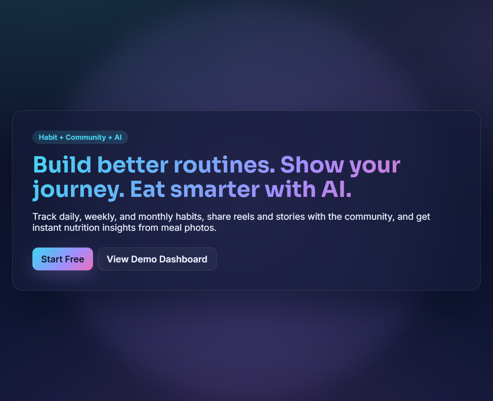

Source: [web/src/pages/LandingPage.jsx](web/src/pages/LandingPage.jsx#L1).

- Single hero section with a soft purple radial glow background.
- Pill **“Habit + Community + AI”** in cyan.
- Large gradient headline: *“Build better routines. Show your journey. Eat smarter with AI.”*
- Sub-copy describing daily/weekly/monthly tracking, reels & stories, nutrition photo analysis.
- Two CTAs: gradient **Start Free** → `/auth/sign-up`, ghost **View Demo Dashboard** → `/dashboard`.

**Mobile:** Onboarding splash with same headline, two CTAs stacked vertically.

---

## 3. `/auth/sign-in` — Sign In

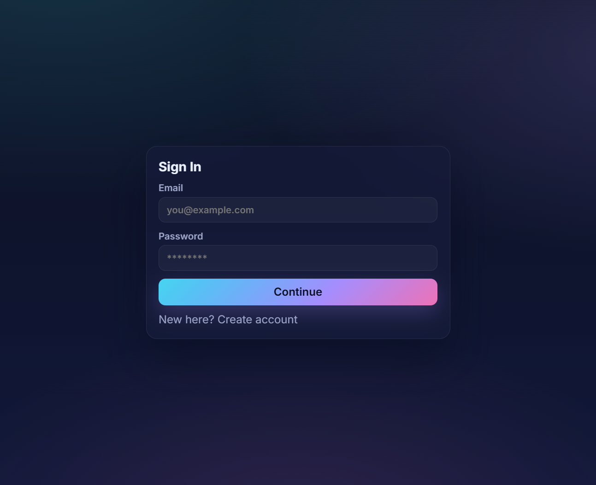

Source: [web/src/pages/SignInPage.jsx](web/src/pages/SignInPage.jsx#L1).

- Centered glass card titled **Sign In**.
- Fields: Email, Password (no validation — purely cosmetic in v4).
- Gradient **Continue** button → `/dashboard`.
- Footer link “New here? Create account” → `/auth/sign-up`.

---

## 4. `/auth/sign-up` — Sign Up

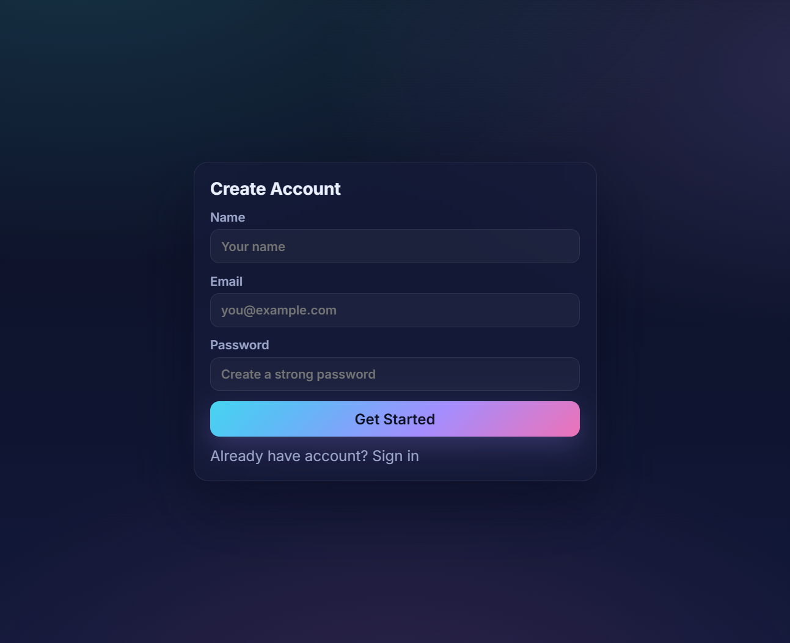

Source: [web/src/pages/SignUpPage.jsx](web/src/pages/SignUpPage.jsx#L1).

- Same glass-card layout as Sign In.
- Fields: Name, Email, Password.
- Gradient **Get Started** → `/dashboard`.
- Footer “Already have account? Sign in”.

---

## 5. `/dashboard` — Dashboard (home)

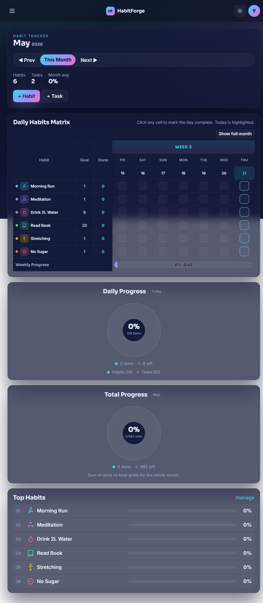

Source: [web/src/pages/DashboardPage.jsx](web/src/pages/DashboardPage.jsx#L1).

Sections (top → bottom):

1. **Month bar card** — eyebrow “HABIT TRACKER”, big month title (`May 2026`), nav buttons
   `◀ Prev` / `This Month` (gradient pill when current) / `Next ▶`, meta strip
   (Habits count, open Tasks count, Month avg %), action buttons `+ Habit` → `/habits` and
   `+ Task` → `/tasks`.
2. **Daily Habits Matrix card** — uses [HabitMatrix](web/src/components/HabitMatrix.jsx#L1).
   Rows = habits with color dot, icon, name, goal column, done count column. Columns = the
   active week (Mon→Sun) with day numbers; today’s column is outlined in cyan. Each cell is a
   square checkbox tinted with the habit’s color. Bottom row shows **Weekly Progress** with a
   gradient progress bar and `done / total` count. Header includes a **Show full month** ghost
   button that expands to all weeks.
3. **Analytics row** (3 cards on web, must stack on mobile):
   - **Daily Progress** donut ([PieChart](web/src/components/PieChart.jsx#L1)) with `x/y items`
     center label and split legend `● Habits done/total · ● Tasks done/total`.
   - **Total Progress** donut for the whole month (units sum).
   - **Top Habits** ordered list — rank `01..`, colored icon, name, gradient progress bar, `%`.
     “manage” link → `/habits`.

**Empty state:** “No habits yet.” + gradient `Create your first habit` button.

---

## 6. `/habits` — Habits

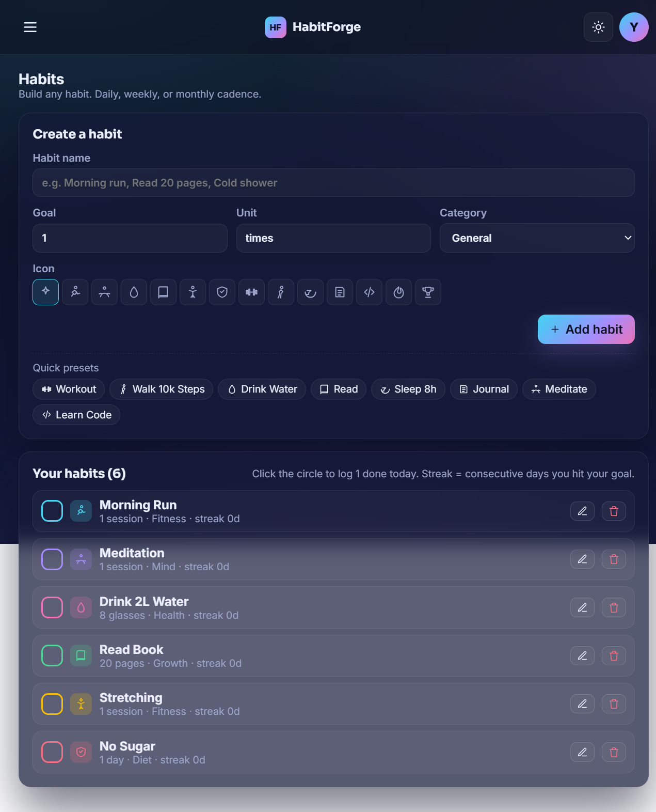

Source: [web/src/pages/HabitsPage.jsx](web/src/pages/HabitsPage.jsx#L1).

Two-column on web (stack on mobile):

1. **Create a habit** card form.
   - Name input.
   - Grid-3: Goal (number), Unit (text — glasses, pages, minutes…), Category (select: General,
     Fitness, Health, Mind, Growth, Diet, Work, Social).
   - **Icon picker** — chips from `HABIT_ICONS` (`spark, run, meditate, water, book, stretch,
     shield, gym, walk, sleep, journal, code, flame, trophy`).
   - Gradient **+ Add habit**.
   - **Quick presets** chip row: Workout, Walk 10k Steps, Drink Water, Read, Sleep 8h, Journal,
     Meditate, Learn Code — each preset adds a fully configured habit instantly.

2. **Your habits (n)** list card.
   - Each row: round check-circle bordered with the habit color (toggles today’s log to the
     full goal), colored icon bubble, name, sub-line `goal unit · category · streak Nd`, edit
     pencil, danger trash.
   - Inline edit grid replaces the row when editing.
   - Streak = `computeStreak()` — consecutive past days where `logs[day] >= goal`.

---

## 7. `/tasks` — Tasks

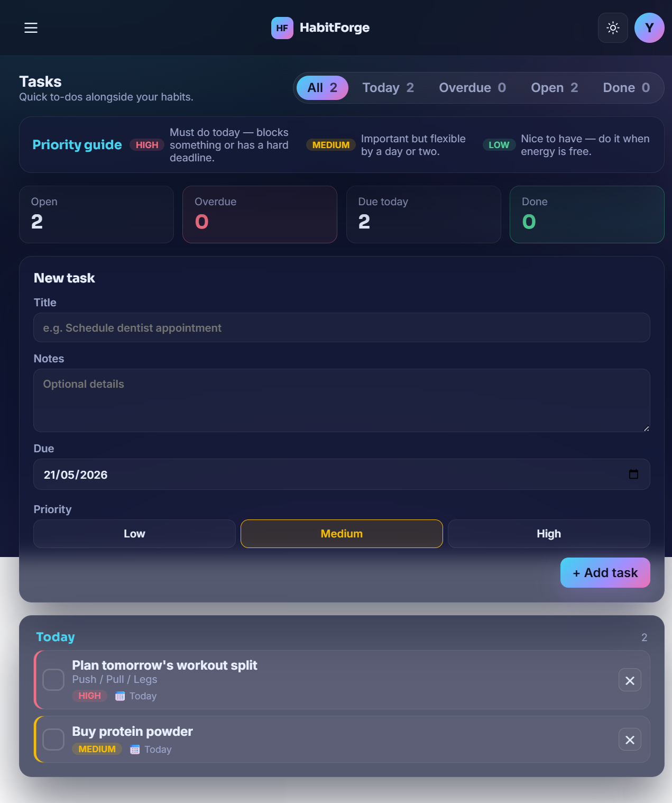

Source: [web/src/pages/TasksPage.jsx](web/src/pages/TasksPage.jsx#L1).

- **Section head** with filter tabs `all | today | overdue | open | done` each showing a count.
- **Priority guide** card explaining `high / medium / low` pills.
- **Stat strip** (4 cards): Open, Overdue (red), Due today, Done (green).
- **New task** form: Title, Notes, Due (date), Priority (3 colored chips). Gradient `+ Add task`.
- **Task board** — grouped by date (`Today`, `Tomorrow`, weekday, or `Completed`):
  - Row: check circle, title, notes (muted small), meta row with priority pill + `📅 due`.
  - Overdue rows tinted red. Delete `✕` on the right.

---

## 8. `/calendar` — Calendar

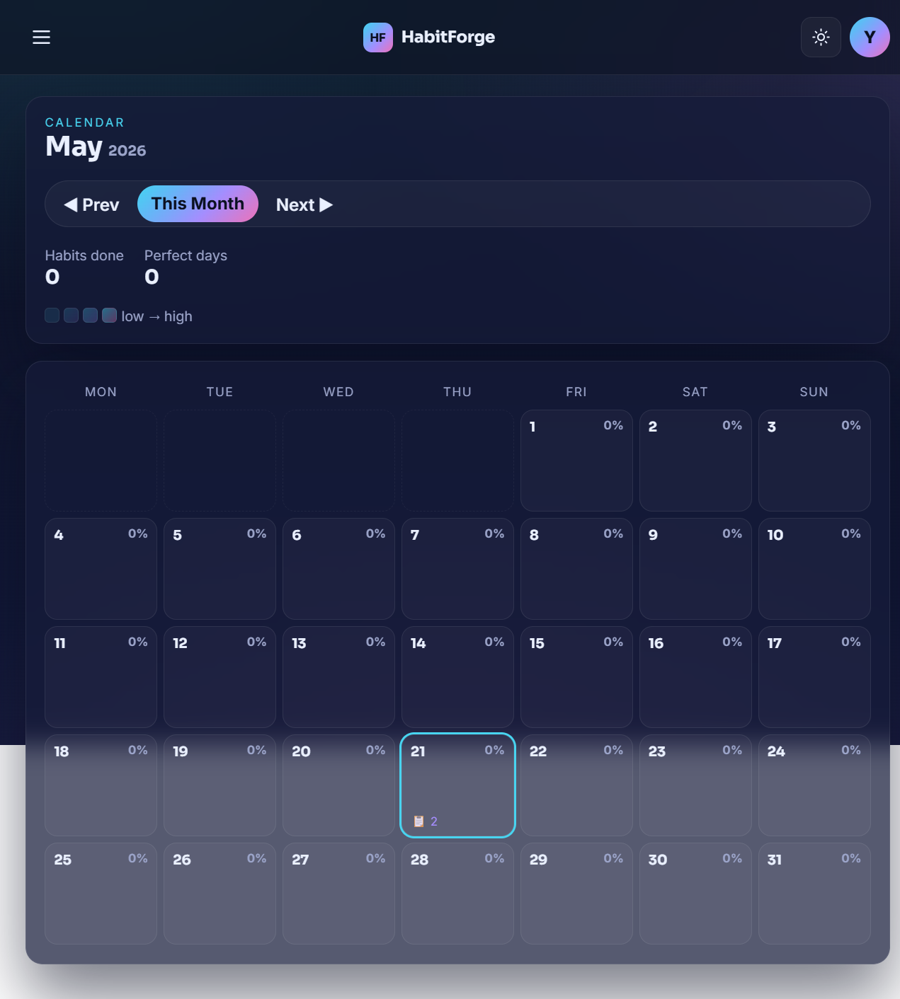

Source: [web/src/pages/CalendarPage.jsx](web/src/pages/CalendarPage.jsx#L1).

- Same month bar as Dashboard with **Habits done** & **Perfect days** meta, plus a heatmap
  legend (`low → high`, 4 levels).
- **Calendar grid** (Mon-first 7-col). Each cell:
  - Background tinted by completion level (`lvl-0..lvl-4`).
  - Top row: day number + completion `%`.
  - Icons row: up to 4 habit emojis completed that day + `+N` overflow.
  - Footer: `📋 N` if tasks due that day.
  - Today is outlined.

---

## 9. `/community` — Community feed

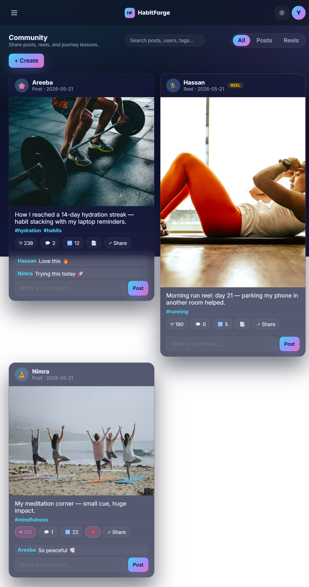

Source: [web/src/pages/CommunityPage.jsx](web/src/pages/CommunityPage.jsx#L1).

- Section head: title, search input (posts / users / tags), tabs `all | posts | reels`,
  gradient `+ Create` → `/community/new-post`.
- **Feed** of `PostCard`s. Each card:
  - Header: avatar emoji bubble, user, kind label + date, `REEL` pill when kind=`reel`.
  - Media: image (reels use 9:16 frame).
  - Caption + hashtag chips.
  - Action bar: like (♥/♡ + count), comment (💬 + count) toggles full thread, repost
    (🔁 + count), save (🔖/📑), share (uses Web Share API).
  - Comments: collapsed to last 2; “View all N comments” expands. Each row: user + text;
    your own comments get a `✕` to delete.
  - Inline comment form at the bottom of every card.

---

## 10. `/community/new-post` — Create Post / Reel

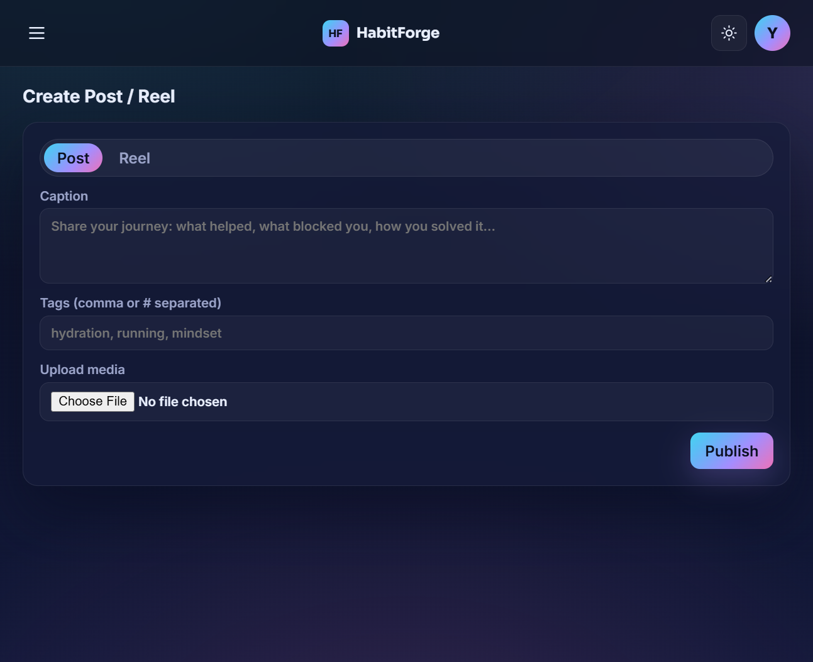

Source: [web/src/pages/CreatePostPage.jsx](web/src/pages/CreatePostPage.jsx#L1).

- Tabs `post | reel`.
- Caption textarea (required).
- Tags input (comma / `#` separated → parsed into array).
- File upload (image / video). When selected, shows a live preview card.
- Gradient **Publish** → returns to `/community` with the new post prepended.

---

## 11. `/journeys/new` — Write Journey Log

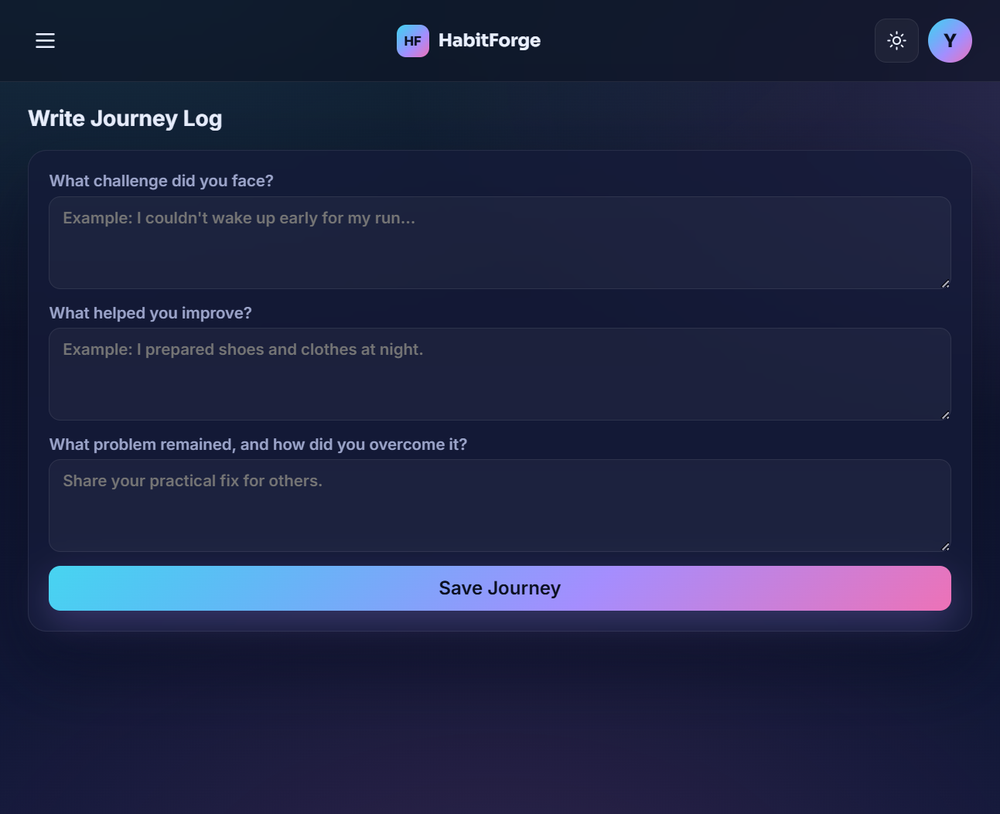

Source: [web/src/pages/JourneyNewPage.jsx](web/src/pages/JourneyNewPage.jsx#L1).

Three guided textareas:

1. What challenge did you face?
2. What helped you improve?
3. What problem remained, and how did you overcome it?

Gradient **Save Journey** (static demo — not yet wired to store).

---

## 12. `/journeys/:journeyId` — Journey Detail

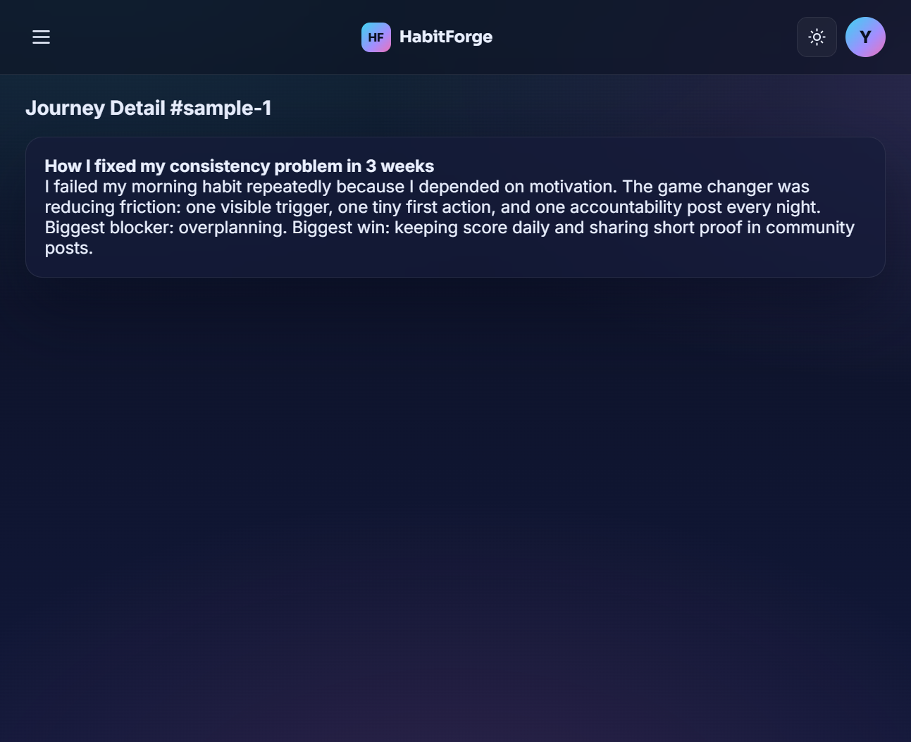

Source: [web/src/pages/JourneyDetailPage.jsx](web/src/pages/JourneyDetailPage.jsx#L1).

Static demo card showing a long-form journey article with title and two paragraphs.

---

## 13. `/nutrition` — Nutrition AI (chat-style)

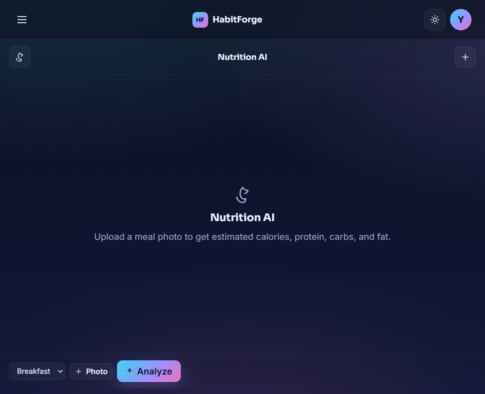

Source: [web/src/pages/NutritionPage.jsx](web/src/pages/NutritionPage.jsx#L1).

ChatGPT-style layout:

- **Left sidebar (drawer):** `+ New` chat, search history, list of past nutrition chats with
  delete on hover, current chat highlighted.
- **Header:** open-history button (left), chat title, `+` new chat (right).
- **Stream area:** empty state shows the nutrition icon, title, and helper text. After analysis,
  message bubbles alternate user / assistant (paragraph-split rendering).
- **Upload bar (bottom):** preview thumbnail (with `✕` clear), meal-type select (Breakfast /
  Lunch / Dinner / Snack), ghost `+ Photo` button (hidden file input), gradient
  **✨ Analyze** (disabled until a photo is picked). On analyze, sends
  `“Analyze my {meal} meal”` and the store responds with calorie / macro / suggestion text.

---

## 14. `/nutrition/upload` — Legacy upload page

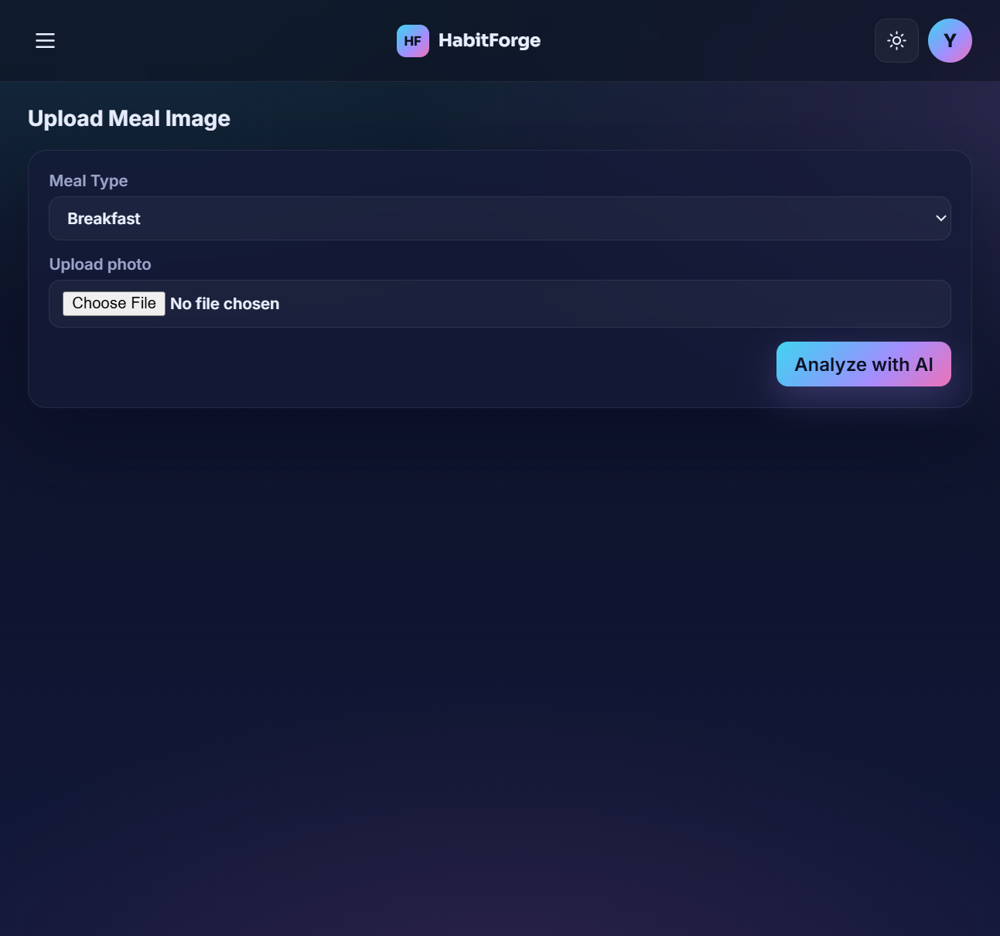

Source: [web/src/pages/NutritionUploadPage.jsx](web/src/pages/NutritionUploadPage.jsx#L1).

Simple form (meal type + file) with a gradient **Analyze with AI** link → mock result page.
(The newer chat flow on `/nutrition` is the primary surface; this is kept for deep links.)

---

## 15. `/nutrition/result/:analysisId` — AI Nutrition Result

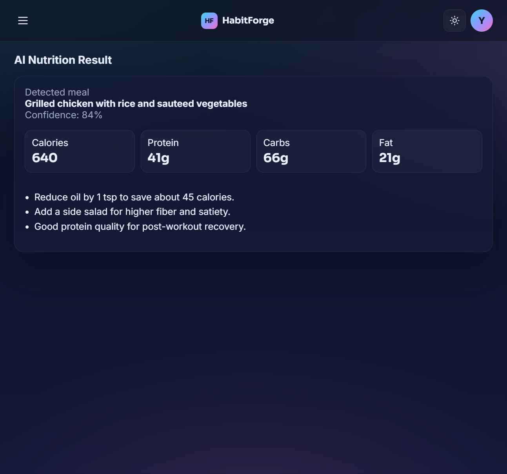

Source: [web/src/pages/NutritionResultPage.jsx](web/src/pages/NutritionResultPage.jsx#L1).

- Card with **Detected meal**, headline, confidence %.
- **Macro mini-cards row** — Calories, Protein, Carbs, Fat.
- Bulleted **Suggestions** list (e.g. “Reduce oil by 1 tsp…”).

Mock data: [web/src/data/mockData.js → mealAnalysis](web/src/data/mockData.js#L51).

---

## 16. `/profile/:username` — Profile

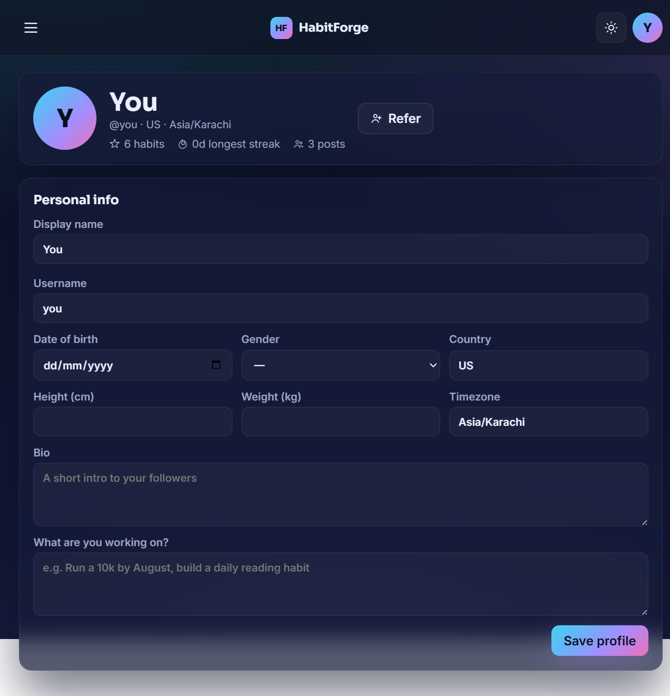

Source: [web/src/pages/ProfilePage.jsx](web/src/pages/ProfilePage.jsx#L1).

- **Profile head card:** big circular gradient avatar with initial, display name (`hero-title`),
  `@username · country · timezone`, stats chips (`habits`, `longest streak (flame)`, `posts`,
  `age`, `BMI`), ghost **Refer** button → `/referral`.
- **Personal info form card:**
  - Grid-2: Display name, Username.
  - Grid-3: Date of birth (date), Gender (select), Country.
  - Grid-3: Height cm, Weight kg, Timezone.
  - Bio textarea.
  - “What are you working on?” goals textarea.
  - Gradient **Save profile** (shows `Saved ✓` for 2s).

---

## 17. `/settings` — Settings

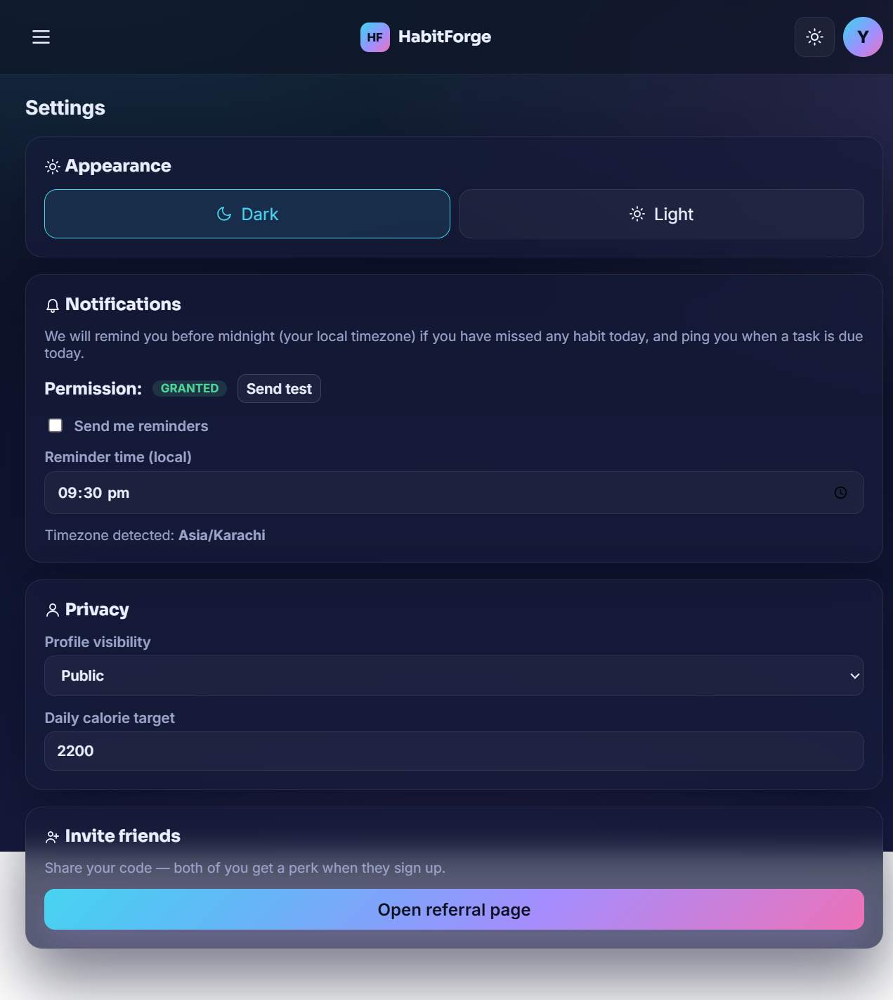

Source: [web/src/pages/SettingsPage.jsx](web/src/pages/SettingsPage.jsx#L1).

Stack of cards:

1. **Appearance** — two theme chips (Dark / Light) with sun/moon icons; active chip gradient.
2. **Notifications** — explanatory copy, permission pill (`default/granted/denied`),
   `Enable notifications` (gradient) or `Send test` (ghost), reminder time picker, detected
   timezone line.
3. **Privacy** — Profile visibility select (public / followers / private), daily calorie target.
4. **Invite friends** — gradient `Open referral page` → `/referral`.

---

## 18. `/coach` — AI Coach (chat-style)

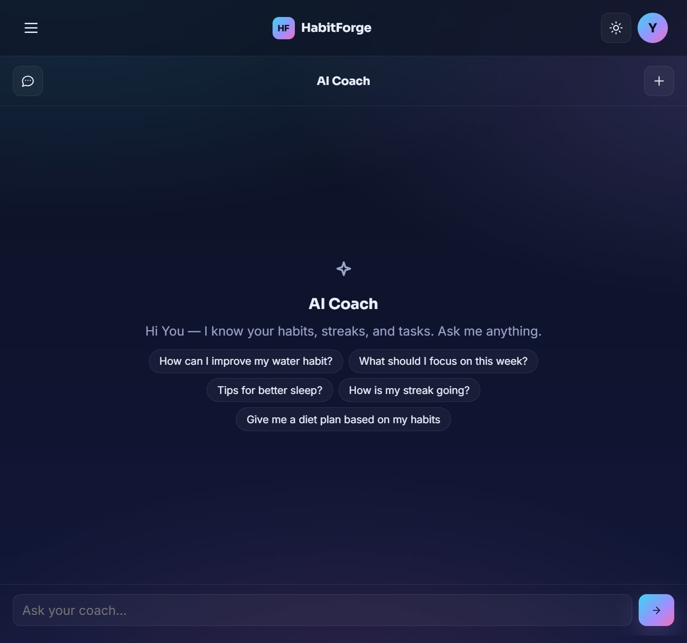

Source: [web/src/pages/CoachPage.jsx](web/src/pages/CoachPage.jsx#L1).

Same ChatGPT layout as Nutrition.

- **Sidebar:** `+ New chat`, search, history list with delete.
- **Header:** open history, title (`AI Coach` or chat title), `+ New chat`.
- **Empty state:** sparkle icon, “AI Coach”, “Hi {name} — I know your habits, streaks, and
  tasks. Ask me anything.”, **prompt chips**:
  - How can I improve my water habit?
  - What should I focus on this week?
  - Tips for better sleep?
  - How is my streak going?
  - Give me a diet plan based on my habits
- **Composer:** rounded input “Ask your coach…” + gradient send button (`→`).
- Replies are built locally by `buildCoachReply()` from the user’s habits / streaks / tasks.

---

## 19. `/referral` — Refer a friend

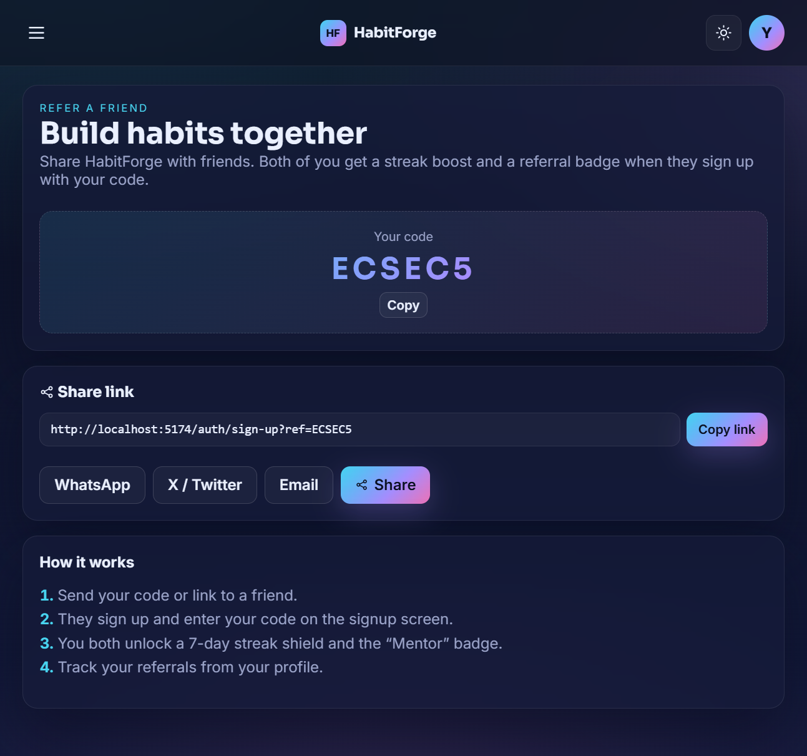

Source: [web/src/pages/ReferralPage.jsx](web/src/pages/ReferralPage.jsx#L1).

- **Hero card:** eyebrow “Refer a friend”, gradient headline “Build habits together”, copy,
  and a right-side block with the user’s code + Copy button (`Copied ✓` confirmation).
- **Share link card:** read-only link `…/auth/sign-up?ref=CODE`, Copy link button,
  channel buttons (WhatsApp, X / Twitter, Email) + gradient native **Share** (Web Share API).
- **How it works** numbered list (1 → 4).

---

## 20. `*` — Not Found

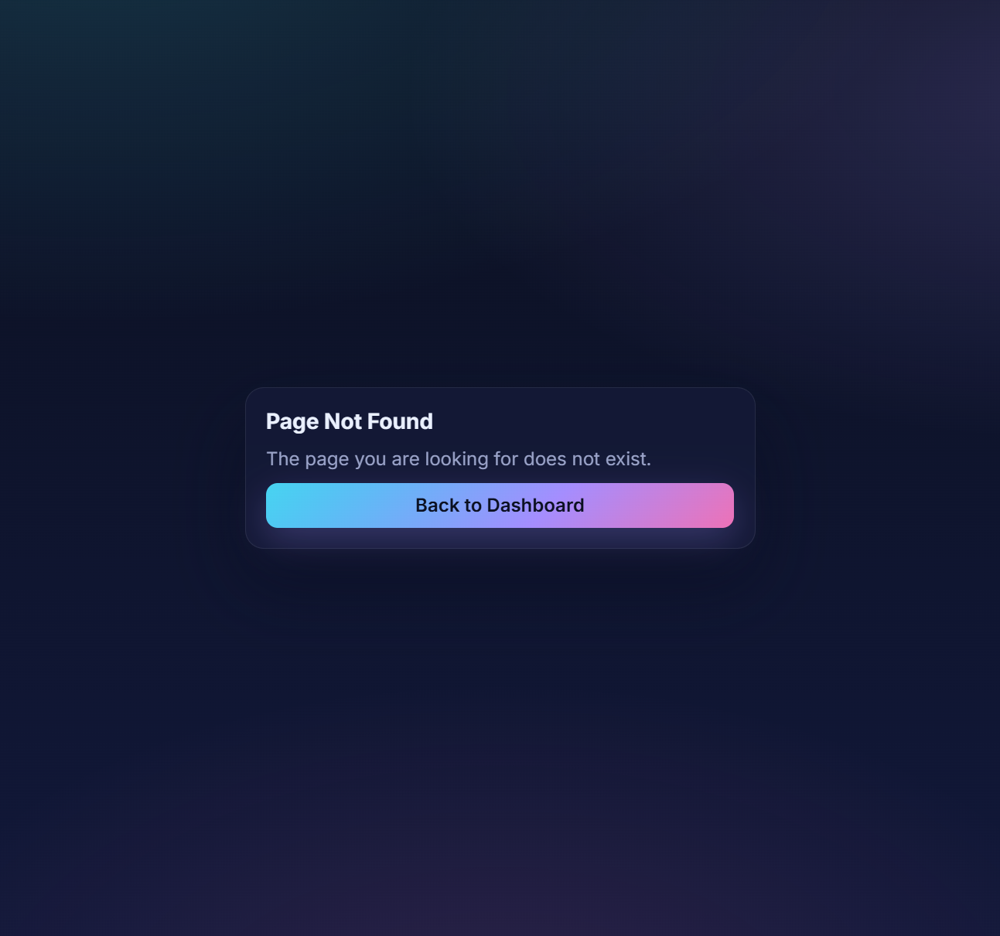

Source: [web/src/pages/NotFoundPage.jsx](web/src/pages/NotFoundPage.jsx#L1).

Centered glass card: “Page Not Found” + gradient **Back to Dashboard**.

---

## 21. Reusable building blocks

| Web component                                            | Mobile equivalent to build                                                  |
| -------------------------------------------------------- | --------------------------------------------------------------------------- |
| [Icon](web/src/components/Icon.jsx#L1)                   | `<Icon name="…" />` wrapper around `lucide-react-native` (same names)        |
| [PieChart](web/src/components/PieChart.jsx#L1)           | `react-native-svg` donut with center label                                  |
| [ProgressRing](web/src/components/ProgressRing.jsx#L1)   | small SVG ring used inside list items                                       |
| [AreaChart](web/src/components/AreaChart.jsx#L1)         | trend line in dashboard analytics (optional v1)                              |
| [DonutRing](web/src/components/DonutRing.jsx#L1)         | thinner donut variant                                                       |
| [HabitMatrix](web/src/components/HabitMatrix.jsx#L1)     | horizontal-scroll table of habit rows × day columns                          |
| [NotificationManager](web/src/components/NotificationManager.jsx#L1) | `expo-notifications` scheduler triggered at `settings.reminderTime` |

**Primary button (mobile):** wrap a `Pressable` with an `expo-linear-gradient` background
`['#22d3ee','#a78bfa','#f472b6']` at `135°`, dark `#0b1020` text, 10px radius, soft violet
shadow.

**Card (mobile):** `View` with `backgroundColor: 'rgba(20,26,56,0.72)'`,
`borderColor: 'rgba(255,255,255,0.08)'`, `borderRadius: 16`, `padding: 16`, and a `BlurView`
underneath when on iOS for the glass effect.

**Background (mobile):** stack three `expo-linear-gradient`s (or a single SVG with `radialGradient`s)
to replicate the cyan / violet / pink glows behind the `bg-0 → bg-1` base.
